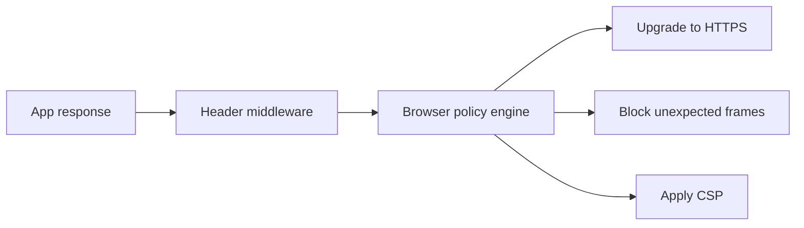

import { ConceptTemplate } from '@/features/kb/components/templates/ConceptTemplate'
import { Callout } from '@/features/kb/components/mdx/Callout'
import { ComparisonTable } from '@/features/kb/components/mdx/ComparisonTable'

export default function Layout({ children }) {
  return (
    <ConceptTemplate title="Security Headers">
      {children}
    </ConceptTemplate>
  )
}

**Security headers** are cheap, declarative controls the browser enforces. They do not replace authz or encoding, but they close entire bug classes (clickjacking, MIME sniffing) and make XSS and cookie theft harder. Set them on every HTML response from a shared middleware, then test with a header scanner and a real browser.

## 1. Deep Dive and Mechanics

Core set: **Strict-Transport-Security** (HSTS) so the browser refuses HTTP after the first HTTPS hit. **Content-Security-Policy** for script control. **frame-ancestors** or X-Frame-Options against framing. **X-Content-Type-Options: nosniff**. **Referrer-Policy**. **Permissions-Policy** to turn off camera, geolocation, and payment APIs you do not use. **Cross-Origin-Opener-Policy** and **Cross-Origin-Resource-Policy** for isolation.

**Cookies are headers too.** Secure, HttpOnly, SameSite, and the __Host- prefix belong in the same review.

<Callout icon="info" title="HSTS has a long memory">
A max-age of months plus includeSubDomains can lock a broken subdomain out of HTTP forever. Roll out on the apex with care, then raise max-age.
</Callout>

## 2. Mathematical / Theoretical Foundation

Headers are a policy language evaluated by the user agent. They change the default ambient authority of a page (who can frame it, what it can load, whether HTTP is allowed). They cannot constrain curl, mobile apps, or a compromised origin. Think of them as shrinking the browser's confused-deputy surface.

<ComparisonTable
  headers={['Header', 'Job', 'Typical value']}
  rows={[
    ['Strict-Transport-Security', 'Force HTTPS', 'max-age=31536000; includeSubDomains'],
    ['Content-Security-Policy', 'Constrain resources', 'nonce-based, object-src none'],
    ['X-Content-Type-Options', 'No MIME sniff', 'nosniff'],
    ['Referrer-Policy', 'Limit URL leaks', 'strict-origin-when-cross-origin'],
  ]}
/>

## 3. Real-World Implementation

```python
SECURITY_HEADERS = {
    'Strict-Transport-Security': 'max-age=31536000; includeSubDomains',
    'X-Content-Type-Options': 'nosniff',
    'Referrer-Policy': 'strict-origin-when-cross-origin',
    'Permissions-Policy': 'camera=(), microphone=(), geolocation=()',
    'Cross-Origin-Opener-Policy': 'same-origin',
}
```

Add CSP per-route if nonces differ. Do not attach HSTS on a plaintext HTTP response you still need for the redirect.

## 4. Visualizations



## 5. Interview Prep

**Q: HSTS vs a 301 to HTTPS?**
**A:** A 301 still allows a first HTTP hit and SSL-strip. HSTS makes later visits HTTPS-only. preload lists go further.

**Q: Why nosniff?**
**A:** Browsers used to guess content types and might execute a user-uploaded file as script.

**Q: Are security headers enough for XSS?**
**A:** No. They reduce impact. Encoding and safe frameworks remain required.

## 6. Production Use Cases

- **Every public HTML** app.
- **API error pages** that still render HTML.
- **Admin** hosts with extra-strict CSP and COOP.

<Callout icon="tip" title="Fail CI if a baseline header disappears">
A one-line middleware regression should page you before a scanner customer does.
</Callout>
