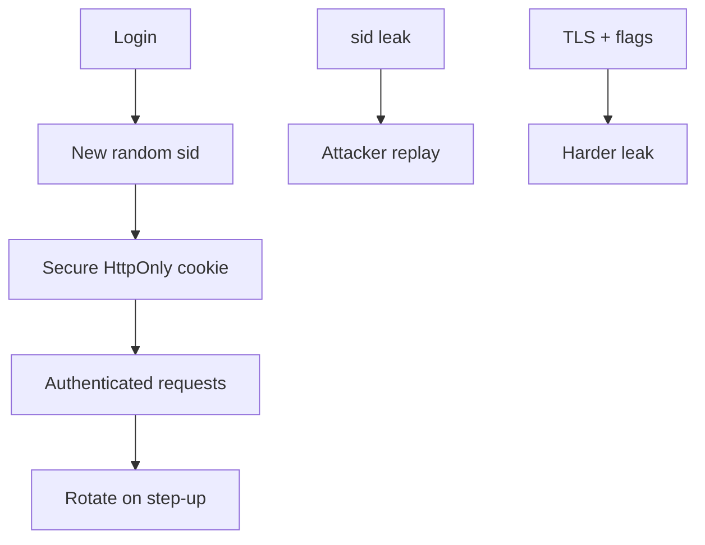

import { ConceptTemplate } from '@/features/kb/components/templates/ConceptTemplate'
import { Callout } from '@/features/kb/components/mdx/Callout'
import { ComparisonTable } from '@/features/kb/components/mdx/ComparisonTable'

export default function Layout({ children }) {
  return (
    <ConceptTemplate title="Session Hijacking">
      {children}
    </ConceptTemplate>
  )
}

**Session hijacking** is using someone else's session id as your own. The id might leak from a URL, a log, XSS reading a non-HttpOnly cookie, a MITM on HTTP, or a predictable generator. Defense is **unguessable ids, TLS everywhere, cookie flags, rotation, and binding**.

## 1. Deep Dive and Mechanics

Issue 128+ bits from a CSPRNG. Put the id in a **Secure; HttpOnly; SameSite** cookie, preferably with the __Host- prefix. Never put it in a query string (Referer leaks). Rotate on login, privilege change, and periodically. Invalidate on logout and password change — including other devices if the user asks.

**Detection.** Sudden ASN or country change can trigger step-up, not a silent lockout that creates support DoS. Store a hash of the session id at rest so a stolen DB of sessions is not immediately usable if you also HMAC with a server secret.

<Callout icon="warning" title="XSS plus a readable session cookie is game over">
HttpOnly stops trivial JS reads. It does not stop the script from acting as the user on your origin. Fix XSS too.
</Callout>

## 2. Mathematical / Theoretical Foundation

A session id is a bearer capability. Security is entropy plus confidentiality of the channel plus **narrowing** (SameSite, binding, short TTL). Prediction attacks are just low-entropy generators (incrementing ints, time-only seeds). Fixing the generator is information-theoretic: the attacker should need 2^128 guesses, which is not online-feasible.

<ComparisonTable
  headers={['Leak path', 'Mitigation']}
  rows={[
    ['HTTP cookie', 'HTTPS + HSTS + Secure flag'],
    ['XSS reads document.cookie', 'HttpOnly + CSP + encoding'],
    ['URL / Referer', 'Never put ids in query strings'],
    ['Shared computer', 'Short TTL, logout, no persist on kiosks'],
  ]}
/>

## 3. Real-World Implementation

```python
import secrets

def issue_session(resp, store):
    sid = secrets.token_urlsafe(32)
    store.save(sid)
    resp.set_cookie(
        '__Host-sid',
        sid,
        secure=True,
        httponly=True,
        samesite='Lax',
        path='/',
    )
```

__Host- requires Secure, no Domain attribute, and Path=/.

## 4. Visualizations



## 5. Interview Prep

**Q: Session fixation vs hijacking?**
**A:** Fixation plants an id before login. Hijacking steals a live id. Rotate-at-login kills fixation; TLS and HttpOnly shrink hijacking.

**Q: Should you bind sessions to IP?**
**A:** Optional signal. Mobile IPs change. Use it for step-up, not hard fail, unless you have a static workforce.

**Q: Server-side session vs JWT?**
**A:** Server sessions revoke instantly. JWTs need short TTL or a blocklist to revoke. Hijacking math is similar if the token is a bearer.

## 6. Production Use Cases

- **Cookie sessions** for web apps.
- **Admin consoles** with 15-minute idle timeout and device lists.
- **Shared-device** modes that skip "remember me".

<Callout icon="tip" title="Offer a session list in account settings">
Users who can revoke other devices close hijacks you will never see in logs in time.
</Callout>
