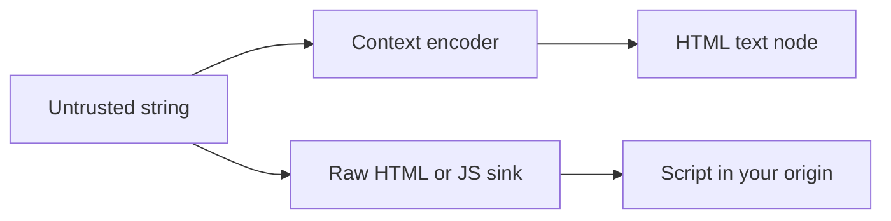

import { ConceptTemplate } from '@/features/kb/components/templates/ConceptTemplate'
import { Callout } from '@/features/kb/components/mdx/Callout'
import { ComparisonTable } from '@/features/kb/components/mdx/ComparisonTable'

export default function Layout({ children }) {
  return (
    <ConceptTemplate title="Cross-Site Scripting (XSS)">
      {children}
    </ConceptTemplate>
  )
}

**XSS** is injecting script into a page that other users (or you) load. The browser then trusts that script as your origin: it can act as the user, read non-HttpOnly storage, and rewrite the DOM. There are three delivery styles — **stored**, **reflected**, **DOM-based** — and one family of fixes: **encode for the context, use safe APIs, and add CSP**.

## 1. Deep Dive and Mechanics

**Stored:** hostile data saved (comment, name) and later rendered. **Reflected:** data from the request bounced into HTML. **DOM-based:** your JavaScript takes a value from location or the DOM and assigns it to a sink such as innerHTML.

**Context is everything.** HTML body, HTML attribute, JS string, URL, and CSS each need a different encoder. Frameworks (React text children, auto-escaping templates) close the common sinks if you do not bypass them with dangerouslySetInnerHTML or raw filters.

**Sanitize HTML** only with a maintained library when you truly need rich text. Do not regex-strip tags.

<Callout icon="error" title="Do not write demo attack strings into docs or tests you copy around">
Test with inert markers and framework unit tests that assert encoding. You do not need a live payload to prove a sink is closed.
</Callout>

## 2. Mathematical / Theoretical Foundation

The browser parses a grammar. XSS is a grammar confusion: data crosses into script or markup nonterminals. Contextual encoding is a **homomorphism into the correct terminal alphabet**. CSP adds a second policy (which scripts may run) so a single encoding slip is less likely to become code. Trusted Types make dangerous sinks throw unless a policy created the string.

<ComparisonTable
  headers={['Kind', 'Where data waits', 'First control']}
  rows={[
    ['Stored', 'Database', 'Encode on output'],
    ['Reflected', 'Request', 'Encode + avoid reflecting into markup'],
    ['DOM-based', 'Client JS', 'textContent, not innerHTML'],
    ['Mutated', 'Browser "helpfully" fixes HTML', 'Do not rely on filters'],
  ]}
/>

## 3. Real-World Implementation

```javascript
el.textContent = userName; // safe for text
el.setAttribute('href', safeHttpUrl(userUrl)); // allowlist scheme

// React: default interpolation is text. Avoid raw HTML APIs.
```

Server templates: use the engine's auto-escape and never mark user input as safe.

## 4. Visualizations



## 5. Interview Prep

**Q: Why encode on output, not input?**
**A:** The same stored value may appear in HTML, JSON, and CSV. Input filtering loses data and misses contexts. Output encoding matches the sink.

**Q: Does CSP make XSS impossible?**
**A:** No. It raises the bar. Nonce leaks, gadget scripts, and 'unsafe-inline' still fail closed or open depending on the policy.

**Q: DOM XSS vs reflected?**
**A:** Reflected is server-rendered. DOM XSS can happen with a static HTML file if client JS copies location.hash into innerHTML.

## 6. Production Use Cases

- **Comment and profile** fields.
- **Search pages** that echo the query.
- **Markdown / WYSIWYG** with a sanitizer.

<Callout icon="tip" title="Ban innerHTML in lint for app code">
Allow it only in a sanitizer module. Most DOM XSS is one assignment.
</Callout>
