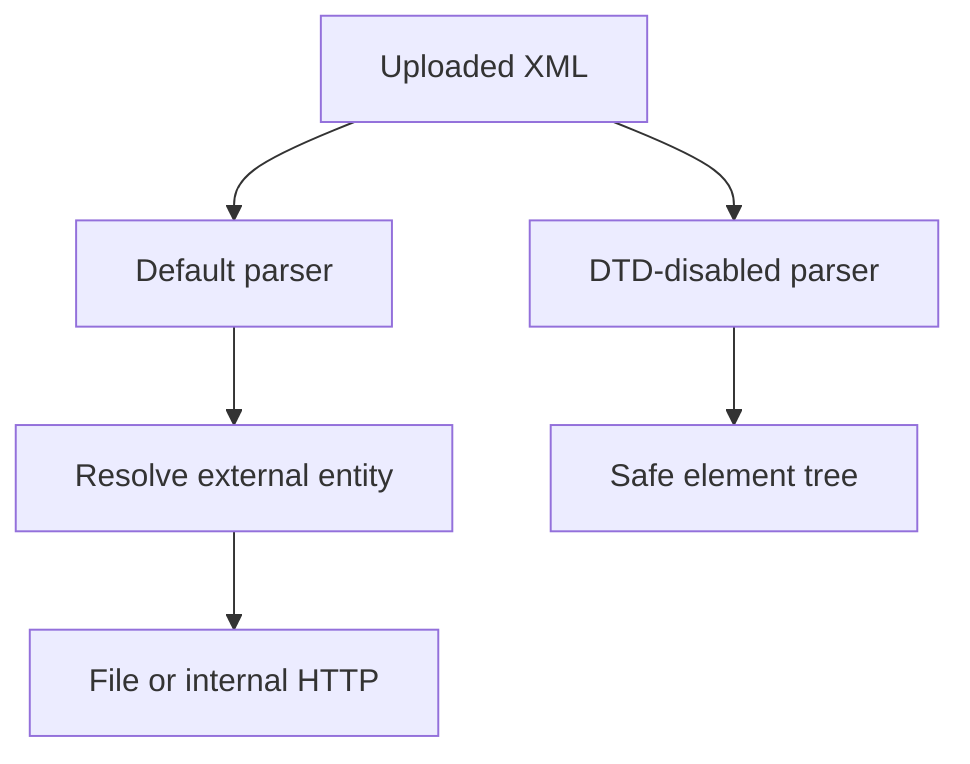

import { ConceptTemplate } from '@/features/kb/components/templates/ConceptTemplate'
import { Callout } from '@/features/kb/components/mdx/Callout'
import { ComparisonTable } from '@/features/kb/components/mdx/ComparisonTable'

export default function Layout({ children }) {
  return (
    <ConceptTemplate title="XML External Entity (XXE)">
      {children}
    </ConceptTemplate>
  )
}

**XXE** is a parser-configuration bug. XML allows entities that expand to file contents or remote URLs. If you parse untrusted XML with defaults from older libraries, those entities resolve on the server. The fix is **disable DTDs and external entities**, or stop using XML.

## 1. Deep Dive and Mechanics

A hostile document can define an entity that points at a local file or an internal URL (SSRF-by-XML). Some parsers also expand parameter entities in ways that lead to denial of service (billion laughs is a related expansion bomb).

**Safe settings.** Disable DTDs, external general entities, and external parameter entities. Do not enable XInclude unless you must, and never on untrusted docs. Prefer JSON APIs.

**Where it hides.** SAML, SOAP, office document formats, RSS importers, and "just upload this XML config" admin tools.

<Callout icon="warning" title="Default parser settings have been wrong for a decade">
If you did not explicitly harden the parser, assume it is unsafe until you prove otherwise on your library version.
</Callout>

## 2. Mathematical / Theoretical Foundation

XML is a document plus an optional DTD language that can perform substitution. Security is turning off that language. Entity expansion is also a complexity attack (exponential or quadratic blow-up). Caps on entity count and size are a resource bound, not a substitute for disabling external resolution.

<ComparisonTable
  headers={['Parser setting', 'Intent', 'Untrusted XML']}
  rows={[
    ['DTDs enabled', 'Legacy docs', 'Off'],
    ['External entities', 'Includes', 'Off'],
    ['XInclude', 'Modular XML', 'Off'],
    ['JSON instead', 'Avoid the class', 'Preferred'],
  ]}
/>

## 3. Real-World Implementation

```python
from defusedxml import ElementTree

def parse_upload(raw: bytes):
    return ElementTree.fromstring(raw)
```

defusedxml rejects the dangerous features. In Java, set the equivalent factory features to false and add unit tests that a DTD-bearing fixture fails closed.

## 4. Visualizations



## 5. Interview Prep

**Q: XXE vs SSRF?**
**A:** XXE can cause SSRF (the parser fetches a URL). SSRF is the broader class of server fetches. Fix both the parser and any explicit URL fetchers.

**Q: Is JSON immune?**
**A:** JSON has no DTD entity system. You still need schema validation. You do not need XXE hardening.

**Q: How do you test without leaking files?**
**A:** Feed a fixture with a DTD and assert the parser errors. Do not point entities at real secrets in tests.

## 6. Production Use Cases

- **Document import** (DOCX/ODF are zip+XML).
- **SAML** libraries — keep them patched and configured.
- **Legacy SOAP** that you should front with a hardened gateway.

<Callout icon="tip" title="Add a unit test that DTD parsing fails">
Configuration drifts when someone "fixes" a customer file by turning DTDs back on. The test is the lock.
</Callout>
