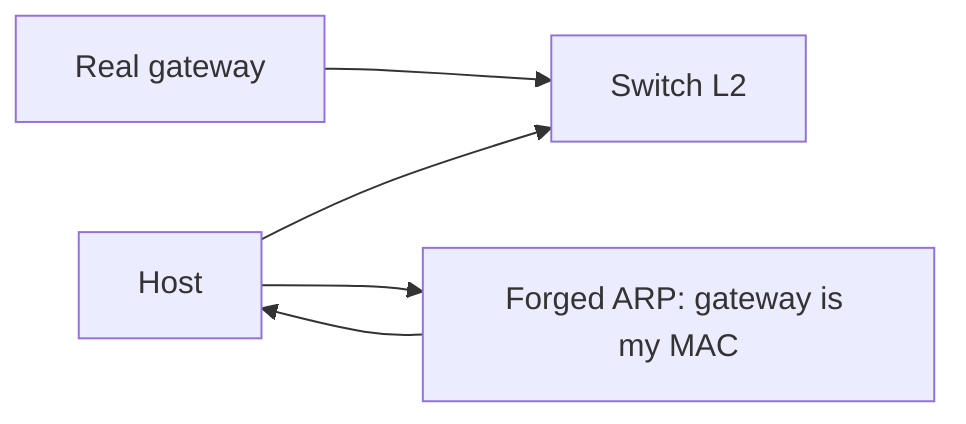

import { ConceptTemplate } from '@/features/kb/components/templates/ConceptTemplate'
import { Callout } from '@/features/kb/components/mdx/Callout'
import { ComparisonTable } from '@/features/kb/components/mdx/ComparisonTable'

export default function Layout({ children }) {
  return (
    <ConceptTemplate title="ARP Spoofing">
      {children}
    </ConceptTemplate>
  )
}

**ARP spoofing** (ARP cache poisoning) targets IPv4 Ethernet LANs. Hosts cache IP-to-MAC mappings from Address Resolution Protocol replies and often accept unsolicited updates. A host that lies about a gateway IP can become a path for traffic. Defense is **do not trust open L2**: dynamic ARP inspection, static mappings for gateways, 802.1X, and encrypt above L2 with TLS.

## 1. Deep Dive and Mechanics

When A wants to reach 192.0.2.1, it asks who has that IP. Anyone on the broadcast domain can answer. Many stacks overwrite the cache. After a false MAC is installed, frames for that IP go to the liar. Combined with IP forwarding, this is a classic on-path position on a flat LAN.

**Where it works.** Shared L2 (cafe Wi-Fi, poorly segmented offices, some cloud "classic" networks). **Where it dies.** L2 isolation (private VLANs, wireless client isolation), DHCP snooping + DAI on campus switches, and overlays that do not use ARP the same way.

**You cannot "ARP-secure the internet".** This is a local-link problem. Users on hostile LANs need TLS and VPNs, not a hope that ARP is honest.

<Callout icon="info" title="IPv6 uses NDP, not ARP">
Neighbor Discovery has its own spoofing story. SEND exists; in practice you still isolate L2 and encrypt.
</Callout>

## 2. Mathematical / Theoretical Foundation

ARP is an unauthenticated broadcast mapping. There is no signature and no nonce binding a reply to a request in the original protocol. Security is therefore **environmental**: shrink the broadcast domain and police who may originate ARP. Encryption at L3/L7 does not stop diversion; it stops reading and changing plaintext.

<ComparisonTable
  headers={['Control', 'Layer', 'Effect']}
  rows={[
    ['Dynamic ARP inspection', 'L2 switch', 'Drops forged ARP vs DHCP binding'],
    ['Static ARP for gateway', 'Host / switch', 'Stops casual gateway theft'],
    ['Client isolation', 'Wi-Fi AP', 'Stations cannot ARP each other'],
    ['TLS / SSH / VPN', 'L5-L7', 'Diverted traffic stays unreadable'],
  ]}
/>

## 3. Real-World Implementation

```text
# Operator checklist (campus access switch)
# 1. Enable DHCP snooping and trust only the real DHCP uplink
# 2. Turn on DAI for user VLANs
# 3. Disable unused switch ports and require 802.1X
```

On endpoints, prefer always-on TLS and a corporate VPN when the LAN is not yours.

## 4. Visualizations



## 5. Interview Prep

**Q: Does HTTPS stop ARP spoofing?**
**A:** It stops the attacker from reading or modifying HTTP. It does not stop them from being on path, dropping packets, or attacking other cleartext protocols.

**Q: Why is this rare in well-built clouds?**
**A:** Hypervisors and SDN program MAC tables and isolate tenant L2. You do not share a promiscuous broadcast domain with strangers.

**Q: ARP spoofing vs MITM?**
**A:** Spoofing is one way to become MITM on a LAN. MITM is the broader on-path role.

## 6. Production Use Cases

- **Campus access** networks with DAI.
- **Guest Wi-Fi** with client isolation.
- **Incident response** when a NIC is in promiscuous mode on a flat VLAN.

<Callout icon="tip" title="Encrypt first, segment second">
You will not DAI every cafe. Assume hostile L2 for laptops and require TLS plus a VPN for corp apps.
</Callout>
