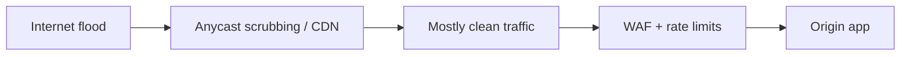

import { ConceptTemplate } from '@/features/kb/components/templates/ConceptTemplate'
import { Callout } from '@/features/kb/components/mdx/Callout'
import { ComparisonTable } from '@/features/kb/components/mdx/ComparisonTable'

export default function Layout({ children }) {
  return (
    <ConceptTemplate title="DDoS Mitigation">
      {children}
    </ConceptTemplate>
  )
}

A **distributed denial of service (DDoS)** attack tries to exhaust bandwidth, packets-per-second, connections, or application work. Mitigation is a stack: **anycast and scrubbing** at the edge, **rate limits and SYN cookies** in the stack, and **cheap application rejects** before expensive work. You cannot out-engineer physics from a single VM.

## 1. Deep Dive and Mechanics

**Volumetric** floods fill the pipe (UDP reflection, amplification). **Protocol** floods exhaust state (SYN, TCP mid-handshake). **Application** floods look like real users (HTTP GETs that hit expensive queries). Each layer needs a different control.

**Edge.** Anycast DNS and CDN/WAF providers spread traffic to many POPs and drop junk close to the source. **Origin.** Keep the origin address hidden. Autoscale for legitimate spikes; do not autoscale blindly into a bill shock without a max.

**Application.** Auth early. Cache. Captchas or proof-of-work only for unauthenticated expensive routes. Timeouts everywhere.

<Callout icon="warning" title="A WAF is not a volumetric shield">
If the pipe to the WAF or origin is full, L7 rules never run. Buy capacity or a scrubbing service for the L3/L4 problem.
</Callout>

## 2. Mathematical / Theoretical Foundation

Availability is a queueing problem. If arrival rate exceeds service rate, latency and loss explode (little's law, bufferbloat). Amplification is a gain factor: small spoofed queries produce large responses toward the victim. Defense reduces gain (disable open resolvers), raises service rate (anycast), and **admits** only a marked subset (tokens, cookies, priority queues for known-good).

<ComparisonTable
  headers={['Layer', 'Symptom', 'First response']}
  rows={[
    ['L3/L4 volumetric', 'Pipe full', 'Anycast / scrubbing'],
    ['TCP state', 'Half-open pileup', 'SYN cookies, conn limits'],
    ['HTTP flood', 'App CPU / DB', 'WAF, cache, auth, shed load'],
    ['Expensive search', 'Query fan-out', 'Hard timeouts, quotas'],
  ]}
/>

## 3. Real-World Implementation

```nginx
limit_req_zone $binary_remote_addr zone=login:10m rate=5r/m;
server {
  location /login {
    limit_req zone=login burst=10 nodelay;
    proxy_read_timeout 5s;
  }
}
```

Pair this with an upstream CDN and an origin allowlist so the internet cannot hit the app directly.

## 4. Visualizations



## 5. Interview Prep

**Q: Why do UDP services get amplified?**
**A:** Spoofed source IPs plus a protocol that answers a small query with a large payload. Fix: disable open services, use anti-spoofing (BCP 38) as an operator.

**Q: Autoscaling as a DDoS defense?**
**A:** It can absorb a modest L7 flood and also bankrupt you. Cap replicas and put a shield in front.

**Q: Any cast vs unicast origin?**
**A:** Anycast lets many POPs share the destination IP so no single link is the choke. Origins stay hidden.

## 6. Production Use Cases

- **Public APIs and games** on a CDN/anycast provider.
- **Auth endpoints** with strict rate limits.
- **Launch events** that look like attacks — runbooks should tell them apart.

<Callout icon="tip" title="Rehearse the 'origin hide' drill">
The first time you move DNS to a scrubber should not be during an outage. Keep runbooks and access pre-staged.
</Callout>
