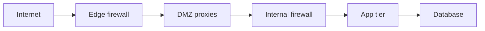

import { ConceptTemplate } from '@/features/kb/components/templates/ConceptTemplate'
import { Callout } from '@/features/kb/components/mdx/Callout'
import { ComparisonTable } from '@/features/kb/components/mdx/ComparisonTable'

export default function Layout({ children }) {
  return (
    <ConceptTemplate title="DMZ">
      {children}
    </ConceptTemplate>
  )
}

A **DMZ** (demilitarized zone) is a network segment for systems that must talk to the untrusted internet (load balancers, reverse proxies, email edge). Firewalls allow only specific flows: internet to DMZ services, DMZ to a few internal apps, and almost nothing from DMZ to workstation VLANs. The idea is **containment**, not magic safety.

## 1. Deep Dive and Mechanics

Classic three-legged firewall: outside, DMZ, inside. Public VIPs live in the DMZ. Application servers and databases live inside. The DMZ host authenticates and proxies; it does not store the crown-jewel database.

**Modern translations.** Cloud public subnets plus private subnets, or a WAF/CDN in front of private origins, are the same pattern. "We put the database in the DMZ so it is easier" is the anti-pattern.

**Jump hosts.** Admin access to DMZ boxes should come from a jump/PAM segment, not from the open internet and not from every laptop VLAN.

<Callout icon="warning" title="A flat 'DMZ VLAN' with 200 apps is not a DMZ">
If every edge box can reach every other edge box and a /16 of internals, you built a staging area for lateral movement.
</Callout>

## 2. Mathematical / Theoretical Foundation

A DMZ is a **cut** in the reachability graph. Security is the size of that cut: few allowed edges, each with a protocol and identity. Compromise of a DMZ node should not increase reachability into the internal set except along those edges. Zero Trust continues the idea by removing implicit trust even after the cut.

<ComparisonTable
  headers={['Placement', 'Internet ingress', 'Data store']}
  rows={[
    ['DMZ proxy / LB', 'Yes', 'No'],
    ['App in private subnet', 'Via proxy only', 'Talks to DB'],
    ['DB in private subnet', 'No', 'Yes'],
    ['DB in DMZ', 'Often accidentally', 'Worst case'],
  ]}
/>

## 3. Real-World Implementation

```text
# Example security-group sketch
# sg-dmz-lb: inbound 443 from 0.0.0.0/0; outbound 443 to sg-app
# sg-app: inbound 443 from sg-dmz-lb; outbound 5432 to sg-db
# sg-db: inbound 5432 from sg-app only
```

Document each allow as a ticketed exception with an owner.

## 4. Visualizations



## 5. Interview Prep

**Q: Is a DMZ obsolete in Zero Trust?**
**A:** The name is old; the isolation is not. You still do not put data stores on public IPs. Zero Trust adds identity to every hop.

**Q: DMZ vs reverse proxy?**
**A:** A reverse proxy is often the DMZ workload. The DMZ is the network placement and policy around it.

**Q: What should never live in a DMZ?**
**A:** Authoritative directories, CAs, backup vaults, and primary databases.

## 6. Production Use Cases

- **On-prem** mail and web edges.
- **Cloud** public ALB subnet vs private ECS/GKE.
- **Partner** file-drop zones with no path to AD.

<Callout icon="tip" title="Draw the allowed flows, then delete the rest">
If you cannot list the edges, you do not have a DMZ. You have a second LAN.
</Callout>
