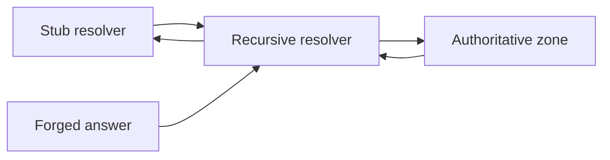

import { ConceptTemplate } from '@/features/kb/components/templates/ConceptTemplate'
import { Callout } from '@/features/kb/components/mdx/Callout'
import { ComparisonTable } from '@/features/kb/components/mdx/ComparisonTable'

export default function Layout({ children }) {
  return (
    <ConceptTemplate title="DNS Attacks">
      {children}
    </ConceptTemplate>
  )
}

**DNS** maps names to data (usually IPs). Attacks either **lie about the mapping**, **steal the zone**, or **use DNS as a covert channel or flood**. Users then go to the wrong host with a perfect TLS warning — or no warning if the attacker also has a cert. Defense is **DNSSEC where it helps, registrar locks, resolver hygiene, and not treating DNS as a secret channel**.

## 1. Deep Dive and Mechanics

**Cache poisoning.** A resolver accepts a forged answer and caches it. Source-port randomization and DNSSEC validation made classic Kaminsky-style poisoning much harder. **Zone hijack.** Weak registrar credentials or compromised DNS host rewrite A and MX records. **DDoS.** Flood the authoritative servers or use them as amplifiers. **Tunneling.** Data stuffed in queries to a controlled zone — detect with length and entropy analytics, then restrict egress resolvers.

**Client path.** DoH/DoT hide queries from the local LAN and shift trust to the resolver operator.

<Callout icon="warning" title="A stolen registrar session beats most crypto">
Lock the domain, use phishing-resistant MFA, and monitor CT logs for unexpected certificates on your names.
</Callout>

## 2. Mathematical / Theoretical Foundation

Classic DNS is an unauthenticated UDP Q/A protocol. The 16-bit TXID plus a 16-bit port is the birthday-bound race that Kaminsky exploited against predictable ports. DNSSEC adds signatures (RRSIG) over records so a validator can reject forgeries — it does not encrypt queries. Confidentiality of the query is a different property (DoT/DoH).

<ComparisonTable
  headers={['Threat', 'Primary control']}
  rows={[
    ['Poisoned cache', 'Random ports, DNSSEC validate'],
    ['Stolen zone', 'Registrar lock, MFA, dual ops'],
    ['NXDOMAIN flood', 'Anycast auth DNS, rate limits'],
    ['Tunnel exfil', 'Forced resolver, inspect, block odd Qtypes'],
  ]}
/>

## 3. Real-World Implementation

```bash
# Check whether a zone publishes DNSSEC signatures
dig example.com DNSKEY +short
dig example.com +dnssec +noall +answer
```

In cloud, require that prod zones live in an account with change tickets and that resolvers used by apps are yours, not 8.8.8.8 from a random pod.

## 4. Visualizations



## 5. Interview Prep

**Q: Does DNSSEC stop phishing sites?**
**A:** No. It stops forgeries of *your* signed records in validating resolvers. A look-alike domain is a different name.

**Q: Why is DNS used for data exfil?**
**A:** It is often allowed out when HTTP is proxied. Fix egress: only your resolver, and watch query volume.

**Q: Split-horizon DNS risks?**
**A:** Internal names that leak to public resolvers, or clients that flip views and cache the wrong answer.

## 6. Production Use Cases

- **Public zones** on anycast DNS with registrar locks.
- **Corp resolvers** that validate DNSSEC and log.
- **Incident response** for sudden A-record changes.

<Callout icon="tip" title="Alert on NS and DS changes">
Those records changing is a five-alarm fire. Wire registrar and DNS host webhooks to the SOC.
</Callout>
