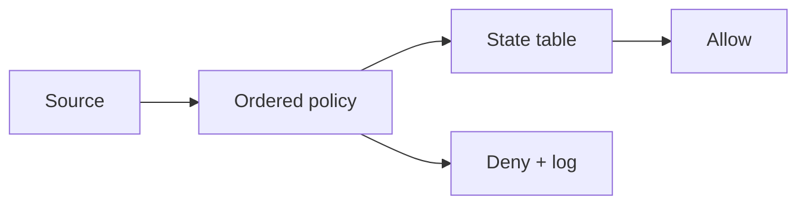

import { ConceptTemplate } from '@/features/kb/components/templates/ConceptTemplate'
import { Callout } from '@/features/kb/components/mdx/Callout'
import { ComparisonTable } from '@/features/kb/components/mdx/ComparisonTable'

export default function Layout({ children }) {
  return (
    <ConceptTemplate title="Firewalls">
      {children}
    </ConceptTemplate>
  )
}

A **firewall** is a policy checkpoint on a network path. Stateless packet filters match addresses and ports. **Stateful** firewalls track connections so return traffic can flow without a matching inbound rule. Next-gen devices add application identification and user identity. Cloud **security groups** are distributed stateful firewalls. None of them replace application authz.

## 1. Deep Dive and Mechanics

Rules are ordered: first match wins, or last match, depending on the product — read the manual. Default deny on inbound is the only sane baseline. Stateful inspection stores 5-tuples and TCP flags so you do not write reciprocal rules for every flow.

**Placement.** Edge (internet), internal segmentation, host (nftables, Windows Firewall), and service mesh sidecars. **Change control** matters more than brand: a 2,000-line any-any leftover is a rumor of a firewall.

**IPv6, ICMP, and fragments** are where rulesets go to die. Test both families.

<Callout icon="info" title="A security group is a firewall">
If every SG allows 0.0.0.0/0 on 443 to the database, you did not "move to the cloud". You opened the world.
</Callout>

## 2. Mathematical / Theoretical Foundation

A filter is a function from packets (or flows) to allow, deny, or log. Stateful firewalls are finite automata keyed by 5-tuple. Correctness is the same as access-control safety: can a packet from untrusted reach a protected asset? Model the policy as a set of allowed edges and prove (or test) that production paths are a subset.

<ComparisonTable
  headers={['Type', 'State', 'Typical place']}
  rows={[
    ['Stateless ACL', 'No', 'Routers, some NACLs'],
    ['Stateful FW / SG', 'Yes', 'Hosts, cloud NICs, NGFW'],
    ['WAF', 'HTTP semantics', 'App edge'],
    ['Mesh sidecar', 'Identity + port', 'Pod to pod'],
  ]}
/>

## 3. Real-World Implementation

```text
# Cloud SG sketch: app may accept 443 only from the load-balancer SG
Inbound: tcp/443 source sg-lb
Outbound: tcp/5432 dest sg-db
Default: deny
```

Prefer SG-to-SG or identity rules over wide CIDRs.

## 4. Visualizations



## 5. Interview Prep

**Q: Security group vs NACL?**
**A:** SGs are stateful and attach to ENIs. NACLs are stateless subnet ACLs. Use SGs as the real control; NACLs as a coarse belt.

**Q: Why default deny?**
**A:** New services should not be reachable until someone writes an allow with an owner. Default allow is entropy.

**Q: Can a firewall stop SQL injection?**
**A:** Not reliably. That is an application bug. A WAF may catch some patterns; fix the query API.

## 6. Production Use Cases

- **VPC / VNet** micro-perimeters.
- **On-prem** plant networks with a narrow IT-OT conduit.
- **Host firewalls** as a last layer if the NIC is moved.

<Callout icon="tip" title="Review any-any rules like they are production incidents">
Each one should have an expiry and an owner. Eternal any-any is how DMZs rot.
</Callout>
