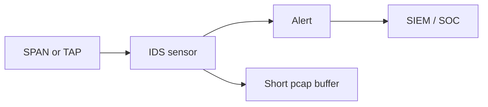

import { ConceptTemplate } from '@/features/kb/components/templates/ConceptTemplate'
import { Callout } from '@/features/kb/components/mdx/Callout'
import { ComparisonTable } from '@/features/kb/components/mdx/ComparisonTable'

export default function Layout({ children }) {
  return (
    <ConceptTemplate title="Intrusion Detection System (IDS)">
      {children}
    </ConceptTemplate>
  )
}

An **IDS** observes. It sits on a TAP, span port, or log stream and says "this looks like a known exploit kit or a weird beacon". It does **not** drop the packet. That is an IPS. Detection quality is a precision/recall problem: too many signatures and you page the SOC into silence; too few and you miss.

## 1. Deep Dive and Mechanics

**Network IDS (NIDS)** reconstructs flows and matches signatures (Snort/Suricata style) or trains baselines. **Host IDS (HIDS)** watches syscalls, files, and process trees (auditd, EDR). Modern shops often fold NIDS into NDR and HIDS into EDR, but the job is the same: **signal for responders**.

**Placement.** You cannot inspect what is encrypted without a decrypt policy (TLS middlebox) or endpoint telemetry. Many teams now detect on metadata (JA3, SNI, flow sizes) plus host sensors instead of full payload.

**Tuning.** Start with high-confidence rules, then add hunt hypotheses. Every rule needs an owner and a runbook.

<Callout icon="info" title="An unread IDS is expensive art">
If alerts do not land in a ticket queue with SLAs, you bought a museum exhibit. Budget people before sensors.
</Callout>

## 2. Mathematical / Theoretical Foundation

Signature detection is pattern matching (Aho-Corasick, PCRE) over streams — high precision for known bits, zero recall for new ones. Anomaly detection is density estimation: flag tails of a baseline. You pay false positives. Evasion is the adversary's encoding problem (fragmentation, encryption, slow-and-low). There is no complete detector; there is a cost curve.

<ComparisonTable
  headers={['Mode', 'Blocks', 'Strength', 'Weakness']}
  rows={[
    ['NIDS signatures', 'No', 'Known attacks', 'Encryption, novelty'],
    ['NIDS anomaly', 'No', 'Unknown floods', 'False positives'],
    ['HIDS / EDR', 'Sometimes', 'Host truth', 'Needs an agent'],
    ['IPS', 'Yes', 'Inline stop', 'Availability risk'],
  ]}
/>

## 3. Real-World Implementation

```text
# Conceptual Suricata placement
# SPAN/TAP -> sensor -> EVE JSON -> SIEM
# Rule policy: emerging-critical.rules enabled; informational disabled
```

Ship EVE or equivalent into the SIEM with the packet pcap kept for a short window so analysts can validate.

## 4. Visualizations



## 5. Interview Prep

**Q: IDS vs IPS?**
**A:** Detect versus detect-and-block. IPS is inline and can outage you. IDS is safer to deploy first.

**Q: Why do encrypted networks weaken NIDS?**
**A:** Payloads are opaque. You still see IPs, SNI, sizes, and timing — or you instrument the endpoint.

**Q: Signature vs anomaly in an interview?**
**A:** Signatures: known bad. Anomaly: unusual. You want both, plus threat intel, plus a human.

## 6. Production Use Cases

- **East-west** visibility in a data center.
- **Compliance** "we monitor" controls with evidence.
- **Hunt** teams using the same sensors.

<Callout icon="tip" title="Measure mean time to triage, not rule count">
A thousand rules that nobody understands are worse than fifty with runbooks.
</Callout>
