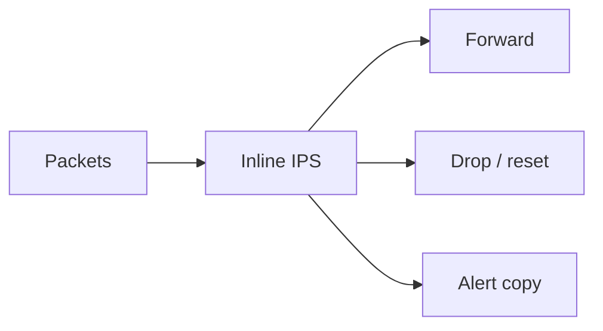

import { ConceptTemplate } from '@/features/kb/components/templates/ConceptTemplate'
import { Callout } from '@/features/kb/components/mdx/Callout'
import { ComparisonTable } from '@/features/kb/components/mdx/ComparisonTable'

export default function Layout({ children }) {
  return (
    <ConceptTemplate title="Intrusion Prevention System (IPS)">
      {children}
    </ConceptTemplate>
  )
}

An **IPS** is an IDS placed **in line**. It can drop packets, reset connections, or tarpit. That is powerful and dangerous: a bad rule or a sensor failure can become a self-inflicted outage. Deploy fail-open versus fail-closed as an explicit business choice, start in detect-only, then promote rules that have earned trust.

## 1. Deep Dive and Mechanics

Traffic must pass through the IPS (or a bump-in-the-cloud equivalent). Matching uses the same signature and reputation engines as IDS, plus rate-based and protocol-anomaly drops. TLS inspection, if used, requires a corporate root on endpoints and a privacy/legal review.

**Cloud equivalents.** WAF plus security-group denies plus gateway firewalls. Host IPS is often the EDR "block" mode.

**Change management.** Every blocking rule needs a rollback. Keep a maintainers' allowlist for scanners and health checks so you do not page yourself.

<Callout icon="warning" title="Fail-closed IPS without HA is a single point of outage">
If the appliance dies and the path dies, you just DDoSed yourself. Design HA or an agreed fail-open.
</Callout>

## 2. Mathematical / Theoretical Foundation

Inline enforcement is a real-time classifier with an asymmetric loss function: false positives cost availability; false negatives cost compromise. Promote rules along a curve: detect, tune, then block. Stateful protocol parsers reduce evasion but add implementation risk (parser bugs become your CVE).

<ComparisonTable
  headers={['Mode', 'On match', 'Outage risk']}
  rows={[
    ['IDS', 'Alert', 'Low'],
    ['IPS detect-only', 'Alert', 'Low'],
    ['IPS drop', 'Silent drop', 'Medium'],
    ['IPS reset', 'RST / block page', 'Medium'],
  ]}
/>

## 3. Real-World Implementation

```text
# Promotion pipeline
# 1. New rule in alert-only for 14 days
# 2. False-positive budget < 1 per day
# 3. Enable drop for that SID on the edge policy
# 4. Keep a one-command disable
```

Never copy a full emerging-threats block set onto an IPS on day one.

## 4. Visualizations



## 5. Interview Prep

**Q: When would you not deploy IPS?**
**A:** Unreliable HA, no rule owners, or a latency-sensitive path you cannot fail-open. Use IDS plus host block instead.

**Q: IPS vs WAF?**
**A:** IPS is usually L3-L4 and generic exploits. WAF speaks HTTP. They overlap; they are not identical.

**Q: What is fail-open vs fail-closed?**
**A:** Open: sensor death lets traffic through (availability). Closed: sensor death blocks (security). Write it down.

## 6. Production Use Cases

- **Internet edge** after a stable detect-only period.
- **OT conduits** with a tiny allowlist and IPS as a backstop.
- **EDR block mode** on workstations.

<Callout icon="tip" title="Page on IPS bypass, not only on IPS hits">
A sensor that stops seeing traffic is as bad as a sensor that never existed.
</Callout>
