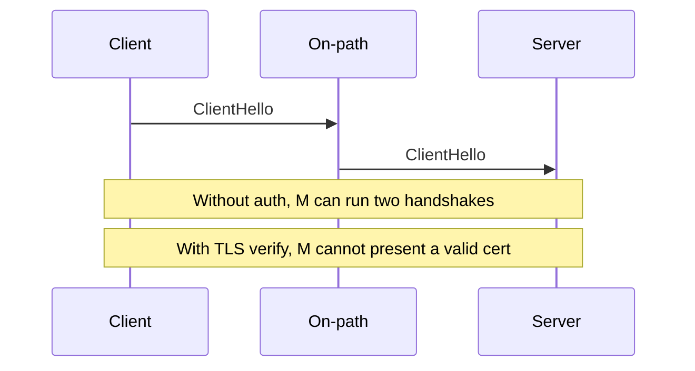

import { ConceptTemplate } from '@/features/kb/components/templates/ConceptTemplate'
import { Callout } from '@/features/kb/components/mdx/Callout'
import { ComparisonTable } from '@/features/kb/components/mdx/ComparisonTable'

export default function Layout({ children }) {
  return (
    <ConceptTemplate title="Man-in-the-Middle Attacks">
      {children}
    </ConceptTemplate>
  )
}

A **man-in-the-middle (MITM)** sits on the path — by routing, proxy, ARP, rogue AP, or a compromised middlebox — and can observe or change traffic. Cryptography's job is to make that position useless: **authenticate the peer, encrypt, and MAC**. TLS with proper certificate checks is the default defense for the web.

## 1. Deep Dive and Mechanics

Without authentication, DH is just two agreements with the middle. With a valid cert and a checked hostname, the middle cannot complete the handshake unless they have a trusted cert for that name (rogue CA, stolen key, or the user clicked through a warning).

**User-assisted MITM.** Installing a mystery root CA, ignoring certificate errors, or using "SSL bump" at a cafe. **Protocol downgrade.** Stripping TLS so the client falls back to HTTP — HSTS fights this.

**Enterprise TLS inspection** is an explicit MITM with a company root. Treat it as a high-value target and a privacy boundary.

<Callout icon="error" title="Certificate warnings are the product">
Teaching users to click through them trains a successful MITM. Fix clocks and names instead.
</Callout>

## 2. Mathematical / Theoretical Foundation

Unauthenticated key exchange is vulnerable to a relay. Authentication binds the key to a name (signature over the transcript). AEAD then gives IND-CCA-style protection of records. The remaining attacks are **outside the crypto**: stolen keys, rogue trust anchors, and endpoints that skip verify.

<ComparisonTable
  headers={['Peer check', 'On-path can decrypt?', 'Typical fail']}
  rows={[
    ['No TLS', 'Yes', 'Cleartext'],
    ['TLS, verify off', 'Yes if they terminate', 'CERT_NONE'],
    ['TLS + hostname + trusted CA', 'No', 'User override, rogue CA'],
    ['TLS + pin / private CA', 'No unless pin leaked', 'Rotation pain'],
  ]}
/>

## 3. Real-World Implementation

```python
import ssl
import socket

ctx = ssl.create_default_context()
with socket.create_connection(('api.example.com', 443)) as s:
    with ctx.wrap_socket(s, server_hostname='api.example.com') as t:
        t.sendall(b'GET /health HTTP/1.1\r\nHost: api.example.com\r\n\r\n')
```

Do not disable verification to "just test". Use a lab CA in the trust store instead.

## 4. Visualizations



## 5. Interview Prep

**Q: Is a VPN anti-MITM?**
**A:** It moves trust to the VPN server and hides the cafe LAN. If the VPN is down and the app falls back to cleartext, you lost.

**Q: HSTS versus pinning?**
**A:** HSTS forces HTTPS to a name. Pinning (or private PKI) shrinks which CAs may speak for you.

**Q: Can you MITM TLS 1.3?**
**A:** Not without a trusted cert or a broken client. You can still drop packets.

## 6. Production Use Cases

- **Public Wi-Fi** threat model for mobile apps (certificate pinning debates).
- **Service-to-service mTLS** so a flipped route is not enough.
- **Corp proxies** that are documented, monitored, and keyed in an HSM.

<Callout icon="tip" title="Never ship CERT_NONE in production builds">
A debug flag that disables verify will leak. Gate it out of release configurations.
</Callout>
