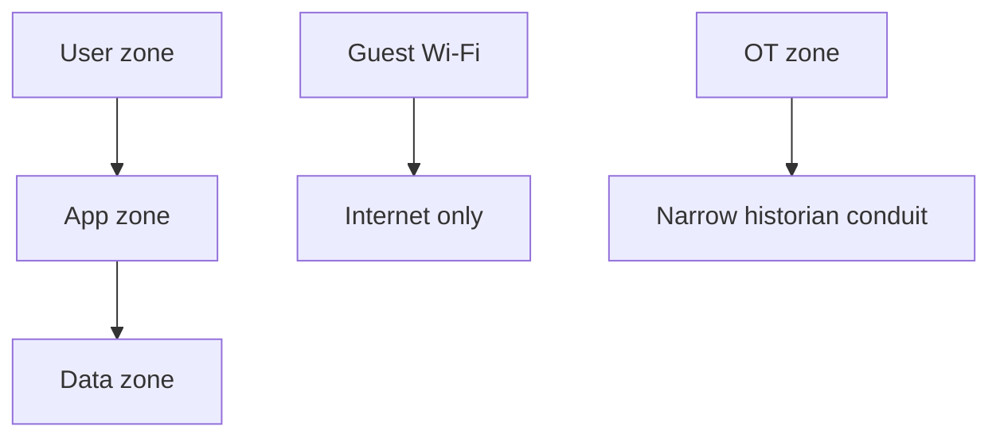

import { ConceptTemplate } from '@/features/kb/components/templates/ConceptTemplate'
import { Callout } from '@/features/kb/components/mdx/Callout'
import { ComparisonTable } from '@/features/kb/components/mdx/ComparisonTable'

export default function Layout({ children }) {
  return (
    <ConceptTemplate title="Network Segmentation">
      {children}
    </ConceptTemplate>
  )
}

**Network segmentation** is cutting the reachability graph. Workstations should not talk to every database. Payment should not share a VLAN with printers. The old version is VLANs and firewalls. The new version adds identity (Zero Trust, service mesh). Both exist to **limit blast radius**.

## 1. Deep Dive and Mechanics

Define zones by trust and function: users, corp servers, PCI, OT, guests, prod, nonprod. Allow only documented conduits. East-west traffic inside a fat VLAN is how ransomware spreads.

**Cloud.** VPCs, subnets, SGs, and private endpoints. **Kubernetes.** NetworkPolicies so a compromised front-end pod cannot scrape the metadata API or the billing DB. **Identity overlay.** Even on one L3 network, mTLS plus policy can segment.

**Avoid "VLAN 1 for everything" and "prod and QA peered with any-any".**

<Callout icon="warning" title="A VLAN without an enforced ACL is a coloring book">
Tags are not policy. Policy is what a firewall, SG, or fabric ACL drops.
</Callout>

## 2. Mathematical / Theoretical Foundation

Think of hosts as vertices and allowed flows as directed edges. Segmentation minimizes edges and clusters high-value assets with a small cut. The "air gap" is the extreme: zero edges. Most businesses need a few monitored edges. Graph cut algorithms are a metaphor; the work is inventory plus deny-by-default.

<ComparisonTable
  headers={['Technique', 'Enforcement', 'Granularity']}
  rows={[
    ['VLAN + ACL', 'L2/L3', 'Subnet'],
    ['SG / firewall', 'L3/L4', 'ENI or host'],
    ['Mesh / ZTNA', 'Identity', 'Service or user'],
    ['Air gap', 'Physics', 'Site'],
  ]}
/>

## 3. Real-World Implementation

```yaml
# Kubernetes NetworkPolicy sketch: only frontend may reach api on 8080
kind: NetworkPolicy
spec:
  podSelector: { matchLabels: { app: api } }
  ingress:
    - from:
        - podSelector: { matchLabels: { app: frontend } }
      ports:
        - port: 8080
```

Pair with a default-deny policy in the namespace.

## 4. Visualizations



## 5. Interview Prep

**Q: Microsegmentation vs classic DMZ?**
**A:** DMZ is one cut at the edge. Microsegmentation puts cuts around each workload. You usually want both.

**Q: Does Zero Trust replace segmentation?**
**A:** It replaces implicit trust on a fat LAN. You still want coarse network cuts for defense in depth.

**Q: How do you prove segmentation works?**
**A:** Attempt connections from a canary in zone A to a listener in zone B and record the deny. Regularly.

## 6. Production Use Cases

- **PCI and HIPAA** cardholder / ePHI enclaves.
- **Ransomware** containment on campuses.
- **Multi-tenant** cloud accounts with separate VPCs.

<Callout icon="tip" title="Segment nonprod from prod">
QA credentials and looser SGs should not be a bridge into production data.
</Callout>
