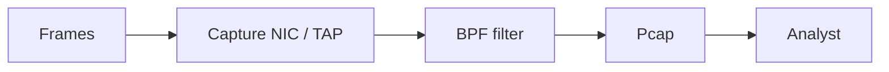

import { ConceptTemplate } from '@/features/kb/components/templates/ConceptTemplate'
import { Callout } from '@/features/kb/components/mdx/Callout'
import { ComparisonTable } from '@/features/kb/components/mdx/ComparisonTable'

export default function Layout({ children }) {
  return (
    <ConceptTemplate title="Packet Sniffing">
      {children}
    </ConceptTemplate>
  )
}

**Packet sniffing** is recording traffic that passes a NIC, TAP, or span. On a hub or a misconfigured switch, a NIC in promiscuous mode sees neighbors. On modern switched networks you usually see only your own frames plus broadcasts — unless you are the gateway, a TAP, or you poisoned L2. For defenders, sniffing is how you debug TLS handshakes and prove an incident. For attackers on a hostile LAN, it is how they harvest cleartext.

## 1. Deep Dive and Mechanics

Capture tools (Wireshark, tcpdump) put an interface in promiscuous or monitor mode and apply BPF filters. Legal and policy rules apply: you capture on systems you are authorized to operate.

**What sniffing cannot do well.** Proper TLS 1.3 payloads without keys. **What it still sees.** DNS (sometimes), SNI, IPs, sizes, timing, and any leftover HTTP or telnet.

**Defense.** Encrypt (TLS, SSH, IPsec), isolate L2, and treat admin capture stations as high-value.

<Callout icon="info" title="Authorization first">
Packet capture on a network you do not operate can be illegal. This page is about defensive telemetry and why encryption matters.
</Callout>

## 2. Mathematical / Theoretical Foundation

A packet is a structured byte string. Capture is sampling a stream. Encryption makes the payload look like high-entropy bits; metadata remains. Traffic analysis (timing, sizes) is a side channel even when AEAD is perfect. Padding and multiplexing (QUIC) reduce some of those leaks.

<ComparisonTable
  headers={['What you capture', 'Cleartext HTTP', 'TLS 1.3']}
  rows={[
    ['URLs and bodies', 'Yes', 'No'],
    ['SNI / destination', 'Host header', 'Often SNI, dest IP'],
    ['Credentials', 'Often', 'No if verify is on'],
    ['Handshake errors', 'n/a', 'Yes, useful for debug'],
  ]}
/>

## 3. Real-World Implementation

```bash
# Authorized debug on a host you own: DNS and TLS handshakes only
sudo tcpdump -i eth0 -n 'port 53 or port 443' -c 100
```

For application debug, prefer structured logs over standing packet captures in prod.

## 4. Visualizations



## 5. Interview Prep

**Q: Promiscuous mode on a switch port — what do you see?**
**A:** Usually just your traffic. To see others you need a TAP/SPAN, a hub, or an L2 attack. Cloud "sniffing neighbors" is generally blocked by the hypervisor.

**Q: How do you debug TLS if you cannot read payloads?**
**A:** Handshake logs, SSLKEYLOGFILE in a lab, or application-level tracing. Do not disable verify.

**Q: Is sniffing the same as MITM?**
**A:** Passive sniffing is observe-only. MITM can alter. Both are defeated for confidentiality by good TLS.

## 6. Production Use Cases

- **Incident response** with a time-boxed TAP.
- **Performance** debugging of retransmits.
- **Teaching** why HTTP basic auth died.

<Callout icon="tip" title="Encrypt management protocols">
SNMPv1, telnet, and HTTP consoles turn every TAP into a password dump. SSH and TLS first.
</Callout>
