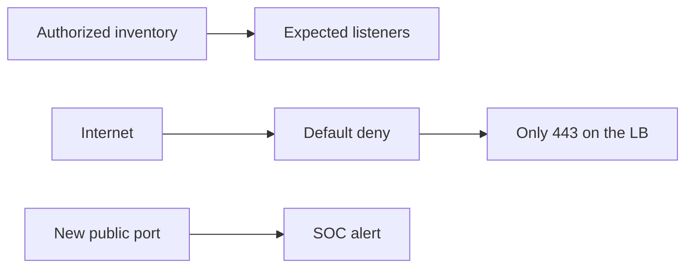

import { ConceptTemplate } from '@/features/kb/components/templates/ConceptTemplate'
import { Callout } from '@/features/kb/components/mdx/Callout'
import { ComparisonTable } from '@/features/kb/components/mdx/ComparisonTable'

export default function Layout({ children }) {
  return (
    <ConceptTemplate title="Port Scanning">
      {children}
    </ConceptTemplate>
  )
}

A **port scan** asks which TCP/UDP ports on a host respond. Defenders scan their own estate to find unexpected listeners. Attackers scan to map attack surface. This page is about **what a scan is, what it leaks, and how you detect and shrink it** — not how to run an offensive campaign.

## 1. Deep Dive and Mechanics

A TCP connect to a closed port usually gets a RST; an open port completes a handshake; a filtered port is silent or ICMP-blocked. Operators use inventory scanners inside a change window with written authorization. Exposed management ports (SSH, RDP, WinRM, databases) on the public internet are the usual finding.

**Defense.** Do not listen on public IPs unless you must. Put admin ports on VPN or ZTNA. Detect scan patterns at the edge (many ports, few packets each) and rate-limit. Banner-free services leak less, but a closed port is better than a stealthy open one.

<Callout icon="info" title="Only scan systems you are allowed to test">
Unauthorized scanning can violate law and policy. Inventory is a defensive control with a ticket and a scope.
</Callout>

## 2. Mathematical / Theoretical Foundation

A scan is a sampling of the function that maps each port to open, closed, or filtered. Information theoretically, each distinct response bit-reduces the unknown configuration. Evasion (slow scans, idle scans) is just a lower sample rate to stay under IDS thresholds. Detection is hypothesis testing on request rates and fan-out.

<ComparisonTable
  headers={['Control', 'Effect']}
  rows={[
    ['No public listener', 'Nothing to find'],
    ['SG / firewall default deny', 'Filtered from the internet'],
    ['ZTNA / VPN admin', 'Ports not on the public map'],
    ['Scan detection', 'SOC signal, not a wall'],
  ]}
/>

## 3. Real-World Implementation

```text
# Defensive posture
# - Inventory listeners with your approved scanner on RFC1918
# - Alert when a new public port appears in cloud config
# - Close RDP/SSH to 0.0.0.0/0
```

Cloud config rules (no 22/3389 from the world) catch more risk than arguing about SYN vs ACK scan types.

## 4. Visualizations



## 5. Interview Prep

**Q: Why do companies scan themselves?**
**A:** Drift. Someone opened 5432 "for a minute". Inventory is how you notice.

**Q: Does hiding port numbers equal security?**
**A:** No. Security through obscurity fails against a thorough scan. Close and authenticate.

**Q: UDP vs TCP scanning?**
**A:** UDP is slower and noisier to interpret (no handshake). Still inventory DNS, VPN, and QUIC listeners.

## 6. Production Use Cases

- **Attack-surface** management for public cloud.
- **Compliance** evidence of closed admin ports.
- **SOC detections** for wide fan-out from a workstation (worm-like).

<Callout icon="tip" title="Alert on new public listeners, not on every SYN">
Config drift is the signal. The internet scans you all day; paging on that is noise.
</Callout>
