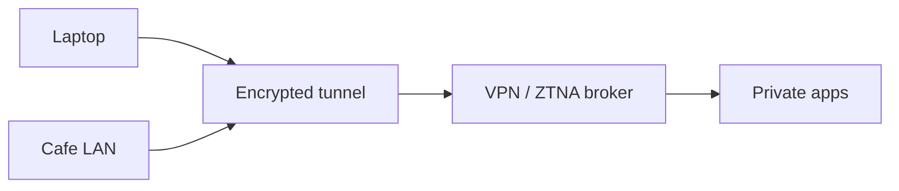

import { ConceptTemplate } from '@/features/kb/components/templates/ConceptTemplate'
import { Callout } from '@/features/kb/components/mdx/Callout'
import { ComparisonTable } from '@/features/kb/components/mdx/ComparisonTable'

export default function Layout({ children }) {
  return (
    <ConceptTemplate title="VPNs">
      {children}
    </ConceptTemplate>
  )
}

A **VPN** (virtual private network) wraps IP traffic in an encrypted tunnel so a cafe or transit network cannot read it, and so a remote host can appear on a private network. Classic remote-access VPNs grant a broad network. **ZTNA** products shrink that to per-app access. Site-to-site IPsec still glues clouds and offices.

## 1. Deep Dive and Mechanics

**Remote access.** Client authenticates (cert or MFA), IKE or a TLS session derives keys, and a virtual interface gets a private IP. Routes decide what goes into the tunnel (full-tunnel vs split-tunnel). **Site-to-site.** Gateways authenticate each other and encrypt selected prefixes.

**Risks.** A VPN that dumps every laptop onto the same /16 is a ransomware highway. Split-tunnel leaks corp DNS or traffic if routes are wrong. Always-on plus device posture beats optional VPN that users turn off.

<Callout icon="warning" title="A VPN is not a product security program">
It hides the cafe. It does not patch your intranet SMB servers or fix IDOR. Combine with segmentation.
</Callout>

## 2. Mathematical / Theoretical Foundation

IKE/IPsec and WireGuard/TLS-VPN are authenticated key exchange plus AEAD for packets. Properties you want: PFS (ephemeral DH), strong identity (device cert, not a shared group password), and replay protection (counters). Split-tunnel is a routing policy, not a crypto property — mis-routed prefixes break confidentiality assumptions.

<ComparisonTable
  headers={['Style', 'Identity', 'Reach']}
  rows={[
    ['Full-tunnel TLS/IPsec', 'User + device', 'Whole intranet'],
    ['Split-tunnel', 'User + device', 'Selected prefixes'],
    ['Site-to-site IPsec', 'Gateway cert/PSK', 'Prefix pairs'],
    ['ZTNA / per-app', 'User + device + app', 'One service'],
  ]}
/>

## 3. Real-World Implementation

```text
# Policy sketch
# - Device cert + MFA to the broker
# - Posture: disk encryption, EDR healthy
# - Routes: only app CIDRs, not 0.0.0.0/0 unless required
# - Intranet still requires SSO on each app
```

Prefer certificate identities over a single pre-shared key for site-to-site.

## 4. Visualizations



## 5. Interview Prep

**Q: Full-tunnel vs split-tunnel?**
**A:** Full-tunnel sends all traffic through corp (better control, more cost). Split-tunnel sends only corp prefixes (better UX, easier leak).

**Q: VPN vs Zero Trust?**
**A:** VPN is a fat pipe onto a network. ZTNA authenticates per application and avoids a shared LAN.

**Q: Why are group PSKs a smell?**
**A:** Everyone shares a secret; rotation is a flag day; you cannot revoke one contractor.

## 6. Production Use Cases

- **Workforce** remote access.
- **Cloud-to-datacenter** prefixes.
- **Partner** extranet with a dedicated VRF.

<Callout icon="tip" title="Log connects and posture fails">
A VPN without device inventory is how former contractors stay on the network.
</Callout>
