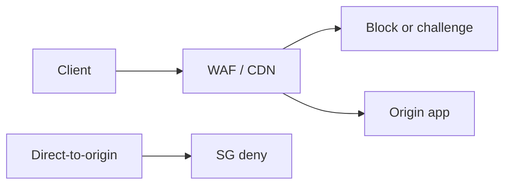

import { ConceptTemplate } from '@/features/kb/components/templates/ConceptTemplate'
import { Callout } from '@/features/kb/components/mdx/Callout'
import { ComparisonTable } from '@/features/kb/components/mdx/ComparisonTable'

export default function Layout({ children }) {
  return (
    <ConceptTemplate title="Web Application Firewall (WAF)">
      {children}
    </ConceptTemplate>
  )
}

A **WAF** sits in front of an HTTP app and inspects methods, paths, headers, and bodies. It can block common injection strings, enforce size limits, add bot challenges, and virtual-patch a CVE until you ship code. It is **not** a substitute for parameterized queries or access control. Treat it as a seatbelt.

## 1. Deep Dive and Mechanics

Modes: detect (log), block, or challenge (CAPTCHA/JS). Rule sets (OWASP CRS) match regular expressions and protocol anomalies. Custom rules encode your business (block /admin from the internet, rate-limit /login). Positioning is usually a CDN or reverse proxy so you also get DDoS absorption.

**Tuning.** Default CRS in block mode will break real apps. Start in detect, add exceptions with owners, then block high-confidence rules. Bypass paths (old origin IP, leftover .git) make the WAF theater.

<Callout icon="warning" title="Hide the origin">
If attackers can hit the app IP directly, they walk around the WAF. Allowlist the WAF egress to the origin.
</Callout>

## 2. Mathematical / Theoretical Foundation

A WAF is a classifier over HTTP messages. Regex rules have high false-positive rates on unusual-but-legal input (O'Reilly in a name). They have false negatives on novel encodings. Defense-in-depth says: WAF raises cost for commodity scans; correct application code is the invariant. Formal language theory again: you cannot regex a context-free SQL grammar into safety.

<ComparisonTable
  headers={['Control', 'Catches', 'Misses']}
  rows={[
    ['WAF signatures', 'Commodity scans', 'Logic bugs, new encodings'],
    ['Parameterized SQL', 'Injection class', 'Need to actually use it'],
    ['Authz tests', 'IDOR', 'WAF almost never sees this'],
    ['Rate limits', 'Credential stuffing', 'Slow distributed stuffing'],
  ]}
/>

## 3. Real-World Implementation

```text
# Origin lock
# - Public DNS points only at the WAF
# - Origin SG: inbound 443 from WAF CIDRs only
# - WAF: block /admin*, rate-limit /login, CRS paranoia level 1
```

Keep an emergency bypass with MFA and a ticket, not a standing hole.

## 4. Visualizations



## 5. Interview Prep

**Q: WAF vs IPS?**
**A:** WAF understands HTTP. IPS understands packets and generic exploits. Use both in different places.

**Q: Can a WAF make a vulnerable app safe?**
**A:** It can buy time. Assume a motivated attacker will find a bypass. Fix the code.

**Q: Positive vs negative security?**
**A:** Negative: block known bad. Positive: allow only known schemas. Positive is stricter and more work.

## 6. Production Use Cases

- **Public internet** apps on a CDN WAF.
- **Virtual patch** windows after a framework CVE.
- **Bot management** on login and checkout.

<Callout icon="tip" title="Measure blocked vs false-positive tickets">
If support volume spikes after a rule, you will turn the WAF off. Tune, do not disable.
</Callout>
