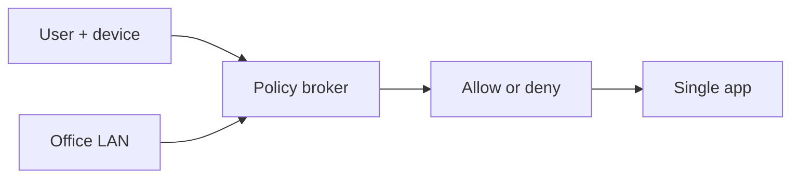

import { ConceptTemplate } from '@/features/kb/components/templates/ConceptTemplate'
import { Callout } from '@/features/kb/components/mdx/Callout'
import { ComparisonTable } from '@/features/kb/components/mdx/ComparisonTable'

export default function Layout({ children }) {
  return (
    <ConceptTemplate title="Zero Trust Networking">
      {children}
    </ConceptTemplate>
  )
}

**Zero Trust networking** rejects the old castle model ("inside the VPN is safe"). Every request is authenticated, authorized, and encrypted, whether it comes from a cafe or the head office. The network is an untrusted pipe. Identity, device posture, and least privilege replace a fat subnet.

## 1. Deep Dive and Mechanics

Principles: authenticate the user and device; authorize the specific resource; encrypt in transit; log the decision; assume breach. Implementations: **ZTNA** brokers, **service mesh mTLS**, **BeyondCorp-style** HTTPS apps with SSO and device certs, and disappearing implicit trust in security groups.

**What you still need.** A physical LAN, some segmentation, and endpoint security. Zero Trust is not a product SKU; it is a policy that products implement.

**Failure mode.** "We bought ZTNA" plus a standing any-any backdoor for "break glass" that never expires.

<Callout icon="info" title="Location is a signal, not a grant">
A corp IP can still be malware. A cafe IP can still be a healthy laptop with a good identity. Score both; do not treat either as destiny.
</Callout>

## 2. Mathematical / Theoretical Foundation

Classic perimeter security is a coarse ACL on topology. Zero Trust is a function from (identity, device, resource, context) to a decision, evaluated per session. That is ABAC plus a hostile-network assumption. Formal goal: compromising one host does not grant ambient authority to the rest of the graph.

<ComparisonTable
  headers={['Model', 'Trusts', 'Access unit']}
  rows={[
    ['Castle / VPN', 'Inside IP', 'Whole network'],
    ['DMZ', 'Fewer inside IPs', 'Segment'],
    ['Zero Trust', 'Identity + posture', 'Application or RPC'],
    ['Mesh mTLS', 'Workload identity', 'Service'],
  ]}
/>

## 3. Real-World Implementation

```text
# Request path
# device cert + SSO + EDR healthy -> broker issues a short-lived grant
# grant is valid for one app, not a /16
# app still does its own user authz
```

Keep break-glass accounts in a vault with dual control and expiry.

## 4. Visualizations



## 5. Interview Prep

**Q: Is Zero Trust anti-firewall?**
**A:** No. You still drop unused ports. You stop believing a source IP means a friend.

**Q: How is this different from a VPN?**
**A:** VPN grants a network. Zero Trust grants an application session after posture checks.

**Q: What is the hardest part?**
**A:** Legacy protocols that cannot do modern identity (old SMB, OT). You wrap them or segment them honestly.

## 6. Production Use Cases

- **Workforce** access to SaaS and internal HTTPS.
- **Service-to-service** mTLS in Kubernetes.
- **Third-party** contractors who should never see the whole LAN.

<Callout icon="tip" title="Start with one app, not a slogan">
Move the VPN-published wiki to SSO + ZTNA, measure tickets, then take the next app. Big-bang Zero Trust dies in procurement.
</Callout>
