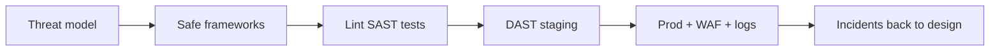

import { ConceptTemplate } from '@/features/kb/components/templates/ConceptTemplate'
import { Callout } from '@/features/kb/components/mdx/Callout'
import { ComparisonTable } from '@/features/kb/components/mdx/ComparisonTable'

export default function Layout({ children }) {
  return (
    <ConceptTemplate title="Application Security">
      {children}
    </ConceptTemplate>
  )
}

**Application security (AppSec)** is the discipline of making software resist abuse. It covers design (threat models), implementation (safe APIs), review, testing (SAST, DAST, unit authz tests), and the supply chain (dependencies, CI). A WAF and a yearly pentest are extras. The core is **engineers shipping safer defaults every week**.

## 1. Deep Dive and Mechanics

Shift-left is jargon for "do not wait for prod". Concrete loop: threat-model new features, use frameworks that escape by default, ban dangerous APIs in lint, require authz tests, scan dependencies, and run DAST on a staging URL. Security champions in each team beat a central team that only says no.

**Scope.** Web, mobile, APIs, background jobs, and admin tools. The forgotten batch job is a frequent hole.

**Metrics that matter.** Time to patch a critical CVE in your deps, percent of routes with authz tests, escaped-prod incident rate. Vanity: number of SAST findings closed by marking "won't fix".

<Callout icon="info" title="AppSec is a software problem">
If the fix is "more firewall", you may have the wrong owner. Most OWASP items die in code review and tests.
</Callout>

## 2. Mathematical / Theoretical Foundation

You cannot prove a large app secure, but you can raise the cost of classes of bugs. Language-theoretic security (separate code and data), least privilege, and type systems that make XSS sinks hard are force multipliers. Risk ranking (OWASP, CVSS for deps) is how you order a queue, not a proof.

<ComparisonTable
  headers={['Control', 'When', 'Catches']}
  rows={[
    ['Threat model', 'Design', 'Missing authz, SSRF features'],
    ['Lint / SAST', 'Commit', 'String-built SQL, raw HTML'],
    ['Authz unit tests', 'Commit', 'IDOR'],
    ['DAST / pentest', 'Staging', 'Runtime config, missed sinks'],
  ]}
/>

## 3. Real-World Implementation

```yaml
# CI sketch
# - lint: no pickle, no shell=True, no innerHTML
# - SAST + SCA on every PR
# - pytest authz tests required for **/routes/**
# - deploy blocked if critical CVE in prod deps without a ticket
```

Keep a living threat model next to the architecture diagram, not in a PDF nobody opens.

## 4. Visualizations



## 5. Interview Prep

**Q: SAST vs DAST?**
**A:** SAST reads code without running it. DAST attacks a running app. You want both; neither replaces authz tests.

**Q: What does an AppSec engineer do all day?**
**A:** Design reviews, dangerous-API bans, pipeline work, incident consults, and teaching. Not only running a scanner.

**Q: How do you handle a huge legacy app?**
**A:** Strangle: safe frameworks for new routes, WAF virtual patch, prioritized rewrite of the money paths.

## 6. Production Use Cases

- **Product engineering** orgs with security champions.
- **Regulated** SDLC evidence (SOC 2 change control).
- **Open-source** products with a disclosure inbox.

<Callout icon="tip" title="Put a security test next to the feature test">
If a route has a happy-path test, it should have a "second user is denied" test. That single habit beats a tool license.
</Callout>
