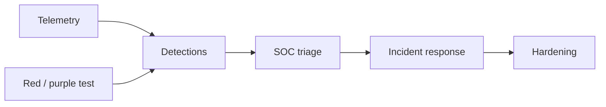

import { ConceptTemplate } from '@/features/kb/components/templates/ConceptTemplate'
import { Callout } from '@/features/kb/components/mdx/Callout'
import { ComparisonTable } from '@/features/kb/components/mdx/ComparisonTable'

export default function Layout({ children }) {
  return (
    <ConceptTemplate title="Blue Teaming">
      {children}
    </ConceptTemplate>
  )
}

**Blue teaming** is defense as a craft: telemetry, detection engineering, incident response, and hardening. If red teams emulate adversaries, blue teams make that emulation noisy and short-lived. A healthy blue team owns **coverage** (can we see it?), **response** (can we evict it?), and **feedback** (did we close the hole?).

## 1. Deep Dive and Mechanics

Daily work: tune SIEM/EDR detections, hunt from intel, run tabletop and purple-team exercises, and fix the control that failed. During an incident: identify, contain, eradicate, recover, and write the post-incident review.

**People and tooling.** SOC analysts, detection engineers, IR, threat intel, and platform folks who can change logging. Tools without playbooks are dashboards.

**Success looks like.** Dwell time down, false-positive rate survivable, and engineering teams taking detection gaps as backlog items.

<Callout icon="info" title="Blue is not 'the people who say no'">
The job is to make the productive path the safe path, then prove you would see the other path.
</Callout>

## 2. Mathematical / Theoretical Foundation

Detection is classification under imbalance: almost all telemetry is benign. You optimize precision at a recall the SOC can staff. MITRE ATT&CK is a coverage map (techniques → detections), not a scoreboard. IR is a state machine with clocks (SLA to contain). Purple teaming is closed-loop testing of that map.

<ComparisonTable
  headers={['Function', 'Question', 'Artifact']}
  rows={[
    ['Detection eng', 'Would we alert?', 'Rule + test fixture'],
    ['SOC', 'What is this alert?', 'Ticket + runbook'],
    ['IR', 'How do we evict?', 'Timeline + containment'],
    ['Hardening', 'How does it not recur?', 'Control change'],
  ]}
/>

## 3. Real-World Implementation

```text
# Detection-as-code sketch
# - rule YAML in git
# - unit test: replay a sanitized log fixture, expect a hit
# - deploy via pipeline to the SIEM
# - ATT&CK tag on the rule for coverage reports
```

Never ship a blocking or paging rule without a fixture and an owner.

## 4. Visualizations



## 5. Interview Prep

**Q: Blue vs SOC vs IR?**
**A:** SOC is the operations floor. IR is the major-incident track. Blue team is the broader defensive practice that includes both plus engineering.

**Q: How do you measure a blue team?**
**A:** MTTD, MTTR, percent of ATT&CK techniques you actually test, and repeat-incident rate — not ticket volume.

**Q: What is purple teaming?**
**A:** Red and blue run the same scenario and immediately fix detections. It is a drill, not a surprise exam.

## 6. Production Use Cases

- **Enterprise SOC** with detection-as-code.
- **Cloud** teams watching IAM anomalies and egress.
- **Tabletop** exercises with executives.

<Callout icon="tip" title="Store detections in git">
If a rule exists only in a GUI, it will vanish and nobody will know what coverage you lost.
</Callout>
