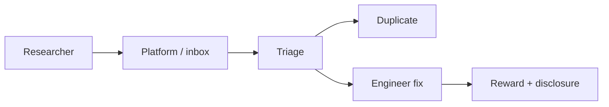

import { ConceptTemplate } from '@/features/kb/components/templates/ConceptTemplate'
import { Callout } from '@/features/kb/components/mdx/Callout'
import { ComparisonTable } from '@/features/kb/components/mdx/ComparisonTable'

export default function Layout({ children }) {
  return (
    <ConceptTemplate title="Bug Bounty Programs">
      {children}
    </ConceptTemplate>
  )
}

A **bug bounty** pays independent researchers for valid vulnerabilities in a published scope. It is not a pentest (time-boxed, contracted) and not a vulnerability disclosure inbox alone (that may pay nothing). A good program has **clear scope, a safe harbor, SLAs, and a triage team**. A bad program is "send us holes" with no lawyer-approved rules and no one to read the mail.

## 1. Deep Dive and Mechanics

Publish in-scope assets and **out-of-scope** items (DoS, social engineering, third-party SaaS you do not own). State the allowed techniques. Promise not to sue researchers who stay in bounds (safe harbor). Pay on a severity table. Triage duplicates quickly and do not argue severity for weeks.

**When to start.** After you can patch. A bounty on an unmaintained app is a press release. Many orgs start with a private program, then go public.

**Relationship to SDLC.** Bounties find leftovers. They do not replace AppSec or access-control tests.

<Callout icon="warning" title="Scope is a safety control">
If you do not exclude destructive testing, someone will. Write the rules like you want them followed on a Friday night.
</Callout>

## 2. Mathematical / Theoretical Foundation

A bounty is a market: you price external search time. Researchers maximize expected payout over their skill and your asset value. Underpaying criticals sends talent to competitors. Overpaying dupes of a known class (reflected XSS on a marketing site) wastes budget. Severity should track impact (data, authz, RCE), not how clever the write-up is.

<ComparisonTable
  headers={['Program', 'Who hunts', 'Best for']}
  rows={[
    ['VDP no pay', 'Altruists / duty', 'Minimum responsible disclosure'],
    ['Private bounty', 'Invited researchers', 'Learning to triage'],
    ['Public bounty', 'Anyone in scope', 'Mature targets'],
    ['Pentest', 'Hired team', 'Time-boxed depth'],
  ]}
/>

## 3. Real-World Implementation

```markdown
# Policy sketch
# Scope: *.app.example.com, official iOS/Android apps
# Out of scope: DoS, physical, third-party IdP bugs, social engineering
# Safe harbor: good-faith research in scope will not be legal threats
# SLA: first response 2 business days
```

Route reports into the same tracker as internal vulns so they get owners.

## 4. Visualizations



## 5. Interview Prep

**Q: Bounty vs pentest?**
**A:** Pentest is scheduled depth with a report. Bounty is continuous, variable quality, and public signaling. Use both.

**Q: Why private first?**
**A:** You learn volume, duplicate rate, and whether you can patch before the internet arrives.

**Q: Do you pay for out-of-scope reports?**
**A:** Usually no. Be kind, be clear, and fix them if they are real anyway.

## 6. Production Use Cases

- **Public SaaS** with a mature AppSec team.
- **Consumer apps** where researchers will look anyway.
- **Open-source** projects using a platform for triage.

<Callout icon="tip" title="Publish a security.txt pointer">
If researchers cannot find the program, they will dump issues on Twitter. Make the inbox obvious.
</Callout>
