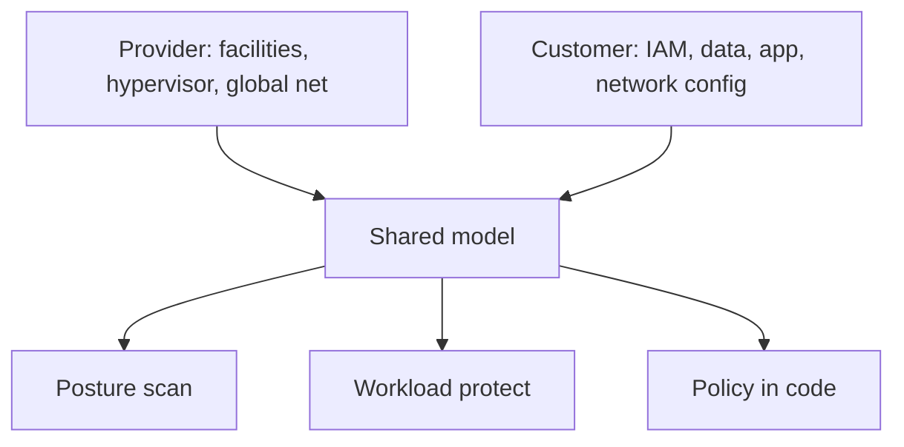

import { ConceptTemplate } from '@/features/kb/components/templates/ConceptTemplate'
import { Callout } from '@/features/kb/components/mdx/Callout'
import { ComparisonTable } from '@/features/kb/components/mdx/ComparisonTable'

export default function Layout({ children }) {
  return (
    <ConceptTemplate title="Cloud Security">
      {children}
    </ConceptTemplate>
  )
}

**Cloud security** is mostly configuration and identity, not a new kind of firewall. The provider secures the buildings, hypervisor, and global network. You secure accounts, keys, networks, data classification, and the software you deploy. Most breaches are public storage, over-broad IAM, and forgotten admin keys — not novel cryptography.

## 1. Deep Dive and Mechanics

Start from the **shared responsibility** line for your service model. IaaS leaves you the guest OS and everything above. PaaS shrinks that. SaaS leaves you identity, data, and how you integrate.

**Control planes beat data planes.** A stolen cloud API key can create, read, and wipe more than a stolen VM password. Prefer short-lived roles, deny public data by default, and treat every region and account as its own blast radius.

**Continuous posture.** Scan for open buckets, 0.0.0.0/0 admin ports, unused access keys, and missing encryption flags. Fix in IaC so the next deploy does not reopen the hole.

<Callout icon="warning" title="The provider will not close your bucket">
Security of the cloud is theirs. Security in the cloud is yours. An open object store is a customer misconfiguration, not a vendor outage.
</Callout>

## 2. Mathematical / Theoretical Foundation

Cloud risk is a graph: principals, roles, resources, and trust edges (assume-role, service accounts, org policies). Effective permission is the reachability of that graph, not the text of one policy document. Least privilege means shrinking the reachable set. Segmentation means cutting edges between accounts and VPCs.

<ComparisonTable
  headers={['Layer', 'You own', 'Typical control']}
  rows={[
    ['IaaS', 'OS, net, data, IAM', 'SG/NACL, disk encryption, IMDSv2'],
    ['PaaS', 'App, data, IAM', 'Private endpoints, secret rotation'],
    ['SaaS', 'Identity, data, config', 'SSO, DLP, admin audit'],
    ['Org', 'Accounts and guardrails', 'SCP, landing zone, CloudTrail'],
  ]}
/>

## 3. Real-World Implementation

```json
{
  "Version": "2012-10-17",
  "Statement": [{
    "Effect": "Allow",
    "Action": ["s3:GetObject"],
    "Resource": "arn:aws:s3:::app-private-prod/*",
    "Condition": {"Bool": {"aws:SecureTransport": "true"}}
  }]
}
```

Grant a role, not a long-lived user key. Log every management event to an append-only account the workload cannot delete.

## 4. Visualizations



## 5. Interview Prep

**Q: Shared responsibility in one sentence?**
**A:** They secure the platform. You secure what you put on it and who can call the APIs.

**Q: Why is IAM the real perimeter?**
**A:** Many workloads have no classic DMZ. A role with s3:* and a leaked key is the breach.

**Q: CSPM vs CWPP?**
**A:** CSPM finds misconfigured cloud resources. CWPP watches the running VM or container.

## 6. Production Use Cases

- **Multi-account orgs** with a security tooling account and SCPs.
- **Data lakes** with blocked public access and KMS CMKs.
- **Regulated SaaS** that must prove encryption and audit trails.

<Callout icon="tip" title="Turn on the logs before the incident">
CloudTrail, activity logs, and admin audit are cheap compared with reconstructing a breach from memory.
</Callout>
