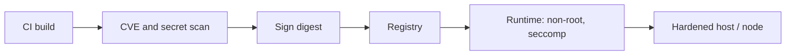

import { ConceptTemplate } from '@/features/kb/components/templates/ConceptTemplate'
import { Callout } from '@/features/kb/components/mdx/Callout'
import { ComparisonTable } from '@/features/kb/components/mdx/ComparisonTable'

export default function Layout({ children }) {
  return (
    <ConceptTemplate title="Container Security">
      {children}
    </ConceptTemplate>
  )
}

A **container** shares a kernel. It is isolation by namespaces, cgroups, and a root filesystem — not a second computer. **Container security** is supply-chain hygiene (what you ship), runtime least privilege (how it runs), and host hardening (what it could escape into). Treating Docker like a VM is how teams skip patches and run as root.

## 1. Deep Dive and Mechanics

**Image.** Start FROM a pinned digest, not latest. Run a non-root USER. Drop packages you do not need. Scan for known CVEs and secrets before push. Sign images and admit only signed digests to prod.

**Runtime.** Read-only root filesystem. Drop Linux capabilities. No privileged flag. No hostPath to the Docker socket. Resource limits so one pod cannot starve the node.

**Registry and CI.** Private registries, immutable tags for releases, and a break-the-build gate on critical CVEs in your base.

<Callout icon="warning" title="root in a container is still root on a bad day">
Kernel bugs and mis-mounted sockets collapse the namespace story. Privilege is a defect, not a convenience.
</Callout>

## 2. Mathematical / Theoretical Foundation

Isolation is a policy on kernel objects: mount, PID, net, user, IPC. The attack surface is the syscall ABI plus whatever you remounted. User namespaces and seccomp shrink that ABI. The security claim is residual risk after those filters, not "containers are safe."

<ComparisonTable
  headers={['Control', 'Stops', 'Does not stop']}
  rows={[
    ['Non-root USER', 'Trivial host writes', 'Kernel 0-days'],
    ['Read-only FS', 'In-container implants', 'Memory-only payloads'],
    ['Image scan', 'Known CVE in a layer', 'Logic bugs you wrote'],
    ['No docker.sock', 'Trivial escape', 'Other host mounts'],
  ]}
/>

## 3. Real-World Implementation

```dockerfile
FROM python:3.12-slim@sha256:REPLACE_WITH_DIGEST
RUN useradd --uid 10001 --create-home app
WORKDIR /app
COPY --chown=app:app . .
USER 10001
```

In compose or Kubernetes, set readOnlyRootFilesystem and drop ALL capabilities, then add back only what you measured.

## 4. Visualizations



## 5. Interview Prep

**Q: Container vs VM isolation?**
**A:** VMs have a hypervisor boundary. Containers share a kernel. Different threat model.

**Q: Why pin by digest?**
**A:** A tag can move. A digest is the bits you scanned.

**Q: Is Distroless enough?**
**A:** It shrinks the image. You still need a non-root user, network policy, and a patched base.

## 6. Production Use Cases

- **Microservice images** built in CI with a mandatory scan gate.
- **Batch jobs** that must not keep a writable root filesystem.
- **Multi-tenant build** agents that never mount the host runtime socket.

<Callout icon="tip" title="Rebuild on a cadence">
Unchanged app code still inherits base-image CVEs. Rebuild and redeploy regularly.
</Callout>
