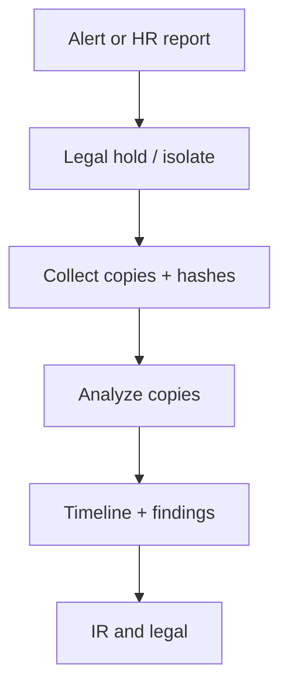

import { ConceptTemplate } from '@/features/kb/components/templates/ConceptTemplate'
import { Callout } from '@/features/kb/components/mdx/Callout'
import { ComparisonTable } from '@/features/kb/components/mdx/ComparisonTable'

export default function Layout({ children }) {
  return (
    <ConceptTemplate title="Digital Forensics">
      {children}
    </ConceptTemplate>
  )
}

**Digital forensics** answers what happened, when, and which artifacts support that story. It is not malware writing and not "hacking back." The first duty is **preservation**: image disks, collect volatile memory if justified, and write a chain of custody so a court or a board can trust the timeline.

## 1. Deep Dive and Mechanics

Work from volatile to durable: running process lists and memory, then disks, then backups and cloud API logs. Hash every artifact (SHA-256) at collection and at each handoff. Use write blockers or API exports that do not mutate the source when you can.

**Order of volatility** and **least surprise** beat clever live edits. Do not "clean" a host you may need as evidence. Isolate it, snapshot it, then analyze copies.

**Cloud and SaaS** shift the evidence to provider logs, object versions, and identity audit trails. You cannot image a multi-tenant control plane; you request the right logs early.

<Callout icon="warning" title="Analysis is done on copies">
One reboot, one "helpful" cleaner, or one in-place AV quarantine can erase the only timeline you had.
</Callout>

## 2. Mathematical / Theoretical Foundation

Integrity of evidence is a hash chain: collect, hash, store, re-hash on access. Timestamps need clock-source notes (NTP drift, timezone). Causation is inferred from multiple independent logs, not a single popup. Legal admissibility extra-requires documented process (chain of custody), not just a clever finding.

<ComparisonTable
  headers={['Source', 'Volatility', 'Typical use']}
  rows={[
    ['Memory / process table', 'Minutes', 'Active implants, keys'],
    ['Disk / volume snapshot', 'Days+', 'Persistence, files'],
    ['Cloud audit / VPC flow', 'Retained if enabled', 'API abuse, exfil path'],
    ['Backups / object versions', 'Long', 'Pre-incident baseline'],
  ]}
/>

## 3. Real-World Implementation

```text
# Collection card (copy, do not improvise on the live box)
# 1. Note UTC time, collector, case id
# 2. Snapshot or image; compute SHA-256
# 3. Store hash + path in the evidence log
# 4. Analyze only the copy
```

Legal hold and HR/privacy review belong in the runbook before you start browsing mailboxes.

## 4. Visualizations



## 5. Interview Prep

**Q: Why hash artifacts?**
**A:** To prove the copy you analyzed is the copy you collected.

**Q: Live response vs full image?**
**A:** Live collection captures RAM and may change the host. Imaging is slower and more complete for disk. Choose from the playbook, not vibes.

**Q: Can you forensicate SaaS?**
**A:** You collect provider audit logs, admin events, and exported mail — not a physical disk.

## 6. Production Use Cases

- **Laptop theft or insider** cases with disk images and access logs.
- **Ransomware** timelines from backups plus EDR telemetry.
- **Cloud account** takeover using CloudTrail or Entra audit.

<Callout icon="tip" title="Enable the logs in peacetime">
Forensics cannot invent a CloudTrail trail that was never on.
</Callout>
