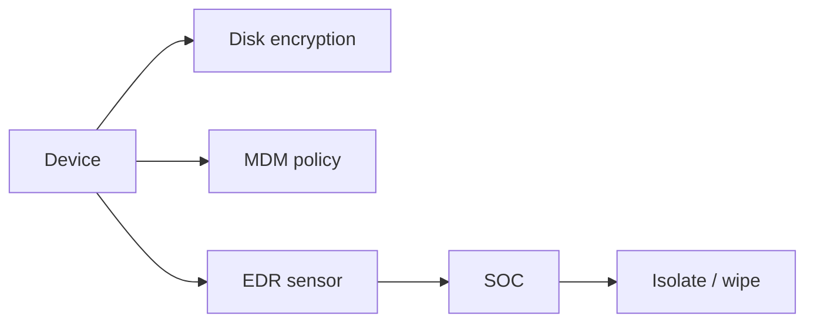

import { ConceptTemplate } from '@/features/kb/components/templates/ConceptTemplate'
import { Callout } from '@/features/kb/components/mdx/Callout'
import { ComparisonTable } from '@/features/kb/components/mdx/ComparisonTable'

export default function Layout({ children }) {
  return (
    <ConceptTemplate title="Endpoint Security">
      {children}
    </ConceptTemplate>
  )
}

**Endpoint security** is the stack on the device: disk encryption, patching, application control, EDR telemetry, and a path to wipe or reimage. The network perimeter no longer sees most work. If the laptop is the office, the laptop is the control point.

## 1. Deep Dive and Mechanics

**Prevent.** Full-disk encryption, secure boot, screen lock, and a current OS. Remove local admin for standard users. Allow-list what you can; do not depend on users to "not click."

**Detect.** EDR records process trees, unsigned loaders, and odd network beacons. It is telemetry plus response (kill process, isolate host), not a 2009 antivirus signature file alone.

**Recover.** You must be able to revoke the device certificate, wipe, and restore from a known-good image. Isolation without a rebuild plan just parks malware.

<Callout icon="info" title="EDR is not a substitute for patching">
A current kernel and browser kill more commodity worms than any dashboard.
</Callout>

## 2. Mathematical / Theoretical Foundation

Detection is a classifier over host events with a false-positive cost (helpdesk) and a false-negative cost (dwell time). Isolation is a graph cut: remove the node from the corporate identity and network overlays. Disk encryption makes confidentiality of a stolen laptop a key-management problem (escrow, TPM) rather than a hope.

<ComparisonTable
  headers={['Control', 'Primary CIA', 'Failure mode']}
  rows={[
    ['Disk encryption', 'Confidentiality', 'Unlocked and logged in'],
    ['Patch + hardening', 'Integrity', 'Unmaintained golden image'],
    ['EDR isolate', 'Availability trade', 'No offline rebuild path'],
    ['MDM wipe', 'Confidentiality', 'Device never enrolled'],
  ]}
/>

## 3. Real-World Implementation

```text
# Baseline for a corporate laptop
# - FileVault / BitLocker with escrowed recovery
# - MDM enrollment required for mail and SSO
# - EDR sensor, tamper protection on
# - Local admin removed; just-in-time elevation
```

Servers need the same idea: gold images, no standing admin, and a sensor that cannot be quietly uninstalled.

## 4. Visualizations



## 5. Interview Prep

**Q: AV vs EDR?**
**A:** AV is mostly known-bad files. EDR keeps a process and network timeline and can contain the host.

**Q: Why remove local admin?**
**A:** Most commodity malware wants a write to Program Files or a driver. Standard users shrink that.

**Q: BYOD?**
**A:** Then you need containerization or a VDI. You cannot EDR a personal phone you do not own.

## 6. Production Use Cases

- **Workforce laptops** with MDM + EDR + disk encryption.
- **Jump boxes** with extra logging and no email client.
- **Kiosks** that reimage on a timer.

<Callout icon="tip" title="Test isolate on a canary host">
A button you have never pressed will fail during the incident.
</Callout>
