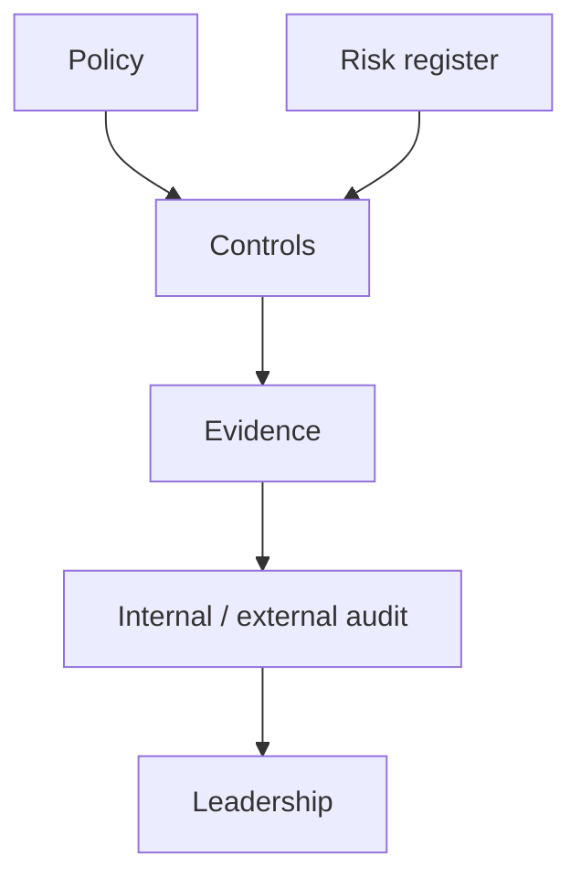

import { ConceptTemplate } from '@/features/kb/components/templates/ConceptTemplate'
import { Callout } from '@/features/kb/components/mdx/Callout'
import { ComparisonTable } from '@/features/kb/components/mdx/ComparisonTable'

export default function Layout({ children }) {
  return (
    <ConceptTemplate title="GRC (Governance, Risk, Compliance)">
      {children}
    </ConceptTemplate>
  )
}

**GRC** is how an organization decides what "secure enough" means and proves it. **Governance** sets ownership and policy. **Risk** ranks what could hurt the mission. **Compliance** maps controls to laws and customer contracts. Without GRC, engineering still patches — but the board cannot tell residual risk from folklore.

## 1. Deep Dive and Mechanics

Write a small set of policies (access, data, incident, vendors). Map each to a control owner and evidence (ticket, config, log). Run a risk register: asset, threat, likelihood, impact, treatment (mitigate, transfer, accept). Review accepted risk on a calendar, not forever.

**Compliance is a mapping, not a product.** SOC 2 and ISO 27001 ask for the same hygiene (access reviews, change control, backups) in different wrappers. Buy a GRC tool only after the register and owners exist in a spreadsheet that people actually update.

<Callout icon="warning" title="A certificate is not a control">
Passing an audit means you produced evidence for a sample. It does not mean the production IAM graph is clean this week.
</Callout>

## 2. Mathematical / Theoretical Foundation

Risk is commonly modeled as likelihood times impact, sometimes with a qualitative matrix to avoid fake precision. Expected loss is useful when you have frequency data (fraud) and misleading when you do not (novel nation-state). Residual risk after treatment should be explicit. Compliance coverage is a many-to-many map: one control can satisfy several framework statements.

<ComparisonTable
  headers={['Word', 'Question', 'Output']}
  rows={[
    ['Governance', 'Who decides?', 'Policy, RACI, board pack'],
    ['Risk', 'What could hurt us?', 'Register and treatments'],
    ['Compliance', 'What must we show?', 'Evidence and attestations'],
    ['Assurance', 'Is it working?', 'Audit, metrics, exceptions'],
  ]}
/>

## 3. Real-World Implementation

```text
# Risk row
# Asset: payroll SaaS
# Threat: stolen admin session
# Treatment: SSO + hardware MFA + quarterly access review
# Evidence: IdP policy export, review ticket
# Owner: Head of People Ops + IT
```

Exceptions need an expiry date and a compensating control, or they become shadow policy.

## 4. Visualizations



## 5. Interview Prep

**Q: GRC vs security engineering?**
**A:** Engineering implements controls. GRC chooses which, tracks exceptions, and talks to auditors.

**Q: Why accept risk?**
**A:** Some treatments cost more than the loss. Acceptance must be named, owned, and time-boxed.

**Q: One framework or many?**
**A:** Pick a backbone (NIST CSF or ISO 27001) and crosswalk the rest so you do not run three ISMS.

## 6. Production Use Cases

- **Enterprise ISMS** with a living risk register.
- **Vendor reviews** before a SaaS admin integration.
- **Board reporting** of residual risk, not ticket counts alone.

<Callout icon="tip" title="Write policies people can obey">
If the policy needs a lawyer to log in, engineers will invent a workaround.
</Callout>
