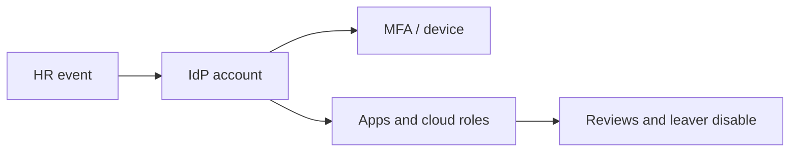

import { ConceptTemplate } from '@/features/kb/components/templates/ConceptTemplate'
import { Callout } from '@/features/kb/components/mdx/Callout'
import { ComparisonTable } from '@/features/kb/components/mdx/ComparisonTable'

export default function Layout({ children }) {
  return (
    <ConceptTemplate title="Identity and Access Management (IAM)">
      {children}
    </ConceptTemplate>
  )
}

**IAM** binds a human or workload to an identity, then grants the least access that still does the job. Passwords are one authenticator. The hard part is **lifecycle**: joiners, movers, leavers, break-glass, and the graph of roles that nobody mapped. Most "we were hacked" stories are "someone still had admin."

## 1. Deep Dive and Mechanics

**Identity.** Unique account, MFA, and a home in a directory or IdP. Prefer SSO over per-app passwords. Workloads get roles, not copied human keys.

**Access.** RBAC for coarse jobs, ABAC or ReBAC when tenancy is messy. Recertify standing access. Prefer just-in-time elevation for admin.

**Governance.** Joiner-mover-leaver from HR. Disable, do not just "remove from the team chat." Log admin APIs. Separate duties for pay and approve.

<Callout icon="warning" title="Shared admin is not an identity">
If five people know the root password, you have no attribution and no leaver process.
</Callout>

## 2. Mathematical / Theoretical Foundation

Access control is a decision function: allow(principal, action, resource, context). Confused deputy and confused tenant bugs happen when a service uses its own powerful identity to act on a caller-supplied id without a check. The IAM graph (who can assume whom) should be acyclic for humans and tightly scoped for workloads.

<ComparisonTable
  headers={['Model', 'Grant style', 'Fits']}
  rows={[
    ['RBAC', 'Roles as job bundles', 'Stable orgs'],
    ['ABAC', 'Attributes and policy', 'Large SaaS tenancy'],
    ['ReBAC', 'Relationship walks', 'Docs, graphs, shares'],
    ['ACL', 'Per-object list', 'Small sets, legacy'],
  ]}
/>

## 3. Real-World Implementation

```text
# Workforce baseline
# - One IdP, SSO to all business apps
# - Phishing-resistant MFA for admins
# - Quarterly access review for privileged roles
# - 15-minute break-glass with paging and recording
```

Cloud IAM needs the same discipline: no long-lived access keys in CI, instance roles only.

## 4. Visualizations



## 5. Interview Prep

**Q: Authentication vs IAM?**
**A:** Authn proves the principal. IAM is the whole lifecycle plus authorization.

**Q: Why JIT admin?**
**A:** Standing Domain Admin is a lottery ticket. Elevation with a ticket and a time box shrinks the window.

**Q: Service accounts?**
**A:** Treat them as identities: owner, rotation, no interactive login, scoped roles.

## 6. Production Use Cases

- **Enterprise SSO** with SCIM provisioning.
- **Cloud landing zones** with permission boundaries.
- **Customer-facing RBAC** in a multi-tenant product.

<Callout icon="tip" title="Measure standing privilege">
Count humans with prod write. Drive that number down every quarter.
</Callout>
