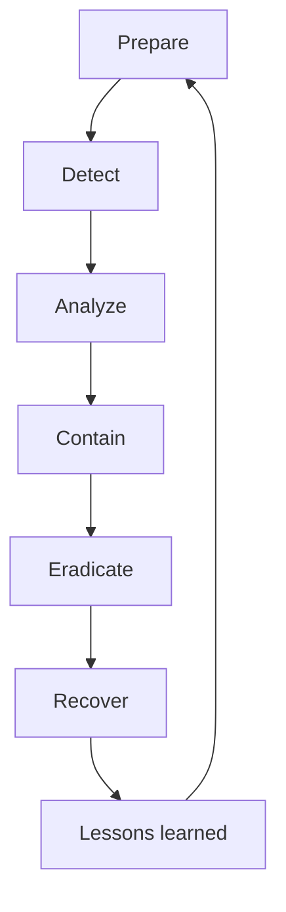

import { ConceptTemplate } from '@/features/kb/components/templates/ConceptTemplate'
import { Callout } from '@/features/kb/components/mdx/Callout'
import { ComparisonTable } from '@/features/kb/components/mdx/ComparisonTable'

export default function Layout({ children }) {
  return (
    <ConceptTemplate title="Incident Response">
      {children}
    </ConceptTemplate>
  )
}

**Incident response (IR)** is the playbook you run when confidentiality, integrity, or availability is in doubt. The goal is to limit damage and restore trust, not to look busy in a chat channel. Good IR is boring: roles, comms, evidence, containment criteria, and a written timeline.

## 1. Deep Dive and Mechanics

A common loop is **NIST 800-61**: prepare, detect and analyze, contain, eradicate, recover, then lessons learned. Preparation is most of the work (logs, contacts, legal, backups you have restored once).

**Containment** is a product decision: isolate a host, revoke a token, disable a rule, or take a service offline. Do not wipe the only evidence. **Comms** need a single voice for customers, regulators, and staff.

Declare severity with a rubric (data type, blast radius, attacker presence), not whoever yells first.

<Callout icon="error" title="Do not freelance on the live box">
Unplanned kills, restores, and "just reboot it" destroy timelines and can re-trigger malware.
</Callout>

## 2. Mathematical / Theoretical Foundation

IR is decision-making under uncertainty with an expanding evidence set. Mean time to detect and mean time to contain are operational metrics; they are not the same as "we feel done." Residual risk after recovery (rotated secrets, remaining sessions) should be listed. Tabletop exercises test the decision graph before the real clock starts.

<ComparisonTable
  headers={['Phase', 'Question', 'Example action']}
  rows={[
    ['Detect', 'Is this real?', 'Triage alert, scope users'],
    ['Contain', 'Can it spread?', 'Isolate host, revoke token'],
    ['Eradicate', 'Root cause gone?', 'Patch, rebuild, rotate'],
    ['Recover', 'Safe to serve?', 'Restore, watch, communicate'],
  ]}
/>

## 3. Real-World Implementation

```text
# Incident header
# Sev / commander / scribe / comms / legal
# Suspected systems and data classes
# Containment taken and time (UTC)
# Evidence locations and hashes
```

Keep a war-room doc that is append-only. Chat is fine; the doc is the record.

## 4. Visualizations



## 5. Interview Prep

**Q: Incident vs event?**
**A:** An event is a logged occurrence. An incident is a declared violation or imminent threat to CIA that needs the process.

**Q: Who is in charge?**
**A:** A named incident commander. Engineers advise; they do not all drive.

**Q: When do you notify?**
**A:** Follow statute and contract clocks (often days, sometimes hours). Legal owns the wording; IR owns the facts.

## 6. Production Use Cases

- **Stolen laptop** with disk encryption plus remote wipe.
- **Leaked CI token** with immediate rotation and repo audit.
- **Ransomware** with isolation and restore from offline backups.

<Callout icon="tip" title="Restore a backup on a Tuesday">
A backup that has never been restored is a rumor.
</Callout>
