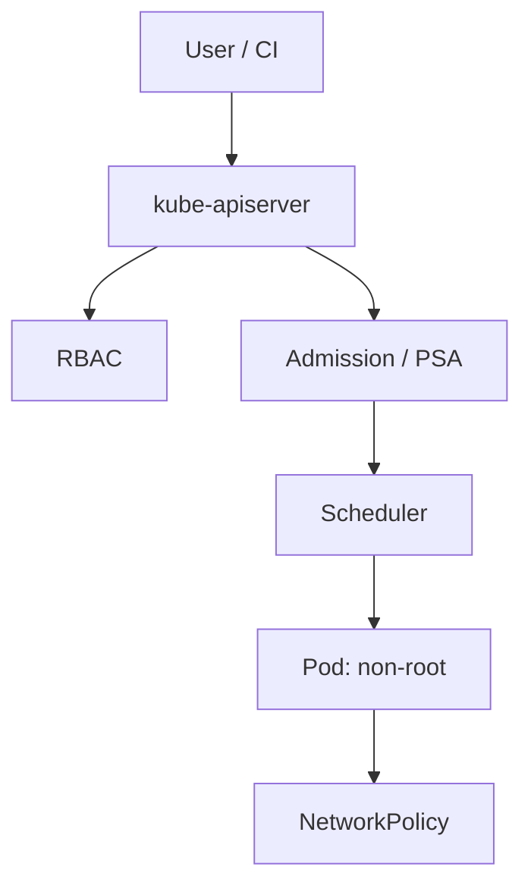

import { ConceptTemplate } from '@/features/kb/components/templates/ConceptTemplate'
import { Callout } from '@/features/kb/components/mdx/Callout'
import { ComparisonTable } from '@/features/kb/components/mdx/ComparisonTable'

export default function Layout({ children }) {
  return (
    <ConceptTemplate title="Kubernetes Security">
      {children}
    </ConceptTemplate>
  )
}

**Kubernetes security** is IAM for an API that can run anything. The kube-apiserver is the real production. RBAC, admission, network policy, and workload identity matter more than a pretty dashboard. A default cluster is a convenience, not a baseline.

## 1. Deep Dive and Mechanics

**Control plane.** TLS everywhere, OIDC or certs for users, no anonymous admin. etcd is a secrets store: encrypt at rest, restrict who can reach it. Audit logs on.

**Workloads.** No privileged pods. No hostNetwork unless you measured why. RunAsNonRoot, read-only root, drop capabilities. Pod Security Admission at restricted. Secrets as files or CSI, not env dumps in tickets.

**Network and supply chain.** Default-deny NetworkPolicy. Admit only signed images from your registry. Separate node pools for untrusted tenants.

<Callout icon="warning" title="cluster-admin is Domain Admin">
A bind of cluster-admin to a CI bot or a human group is a standing superuser. Scope RoleBindings to namespaces.
</Callout>

## 2. Mathematical / Theoretical Foundation

Kubernetes authorization is a chain: authenticators produce a user, authorizers (RBAC, ABAC, webhooks) vote, admission mutates and validates. Effective permission is the union of RoleBindings. NetworkPolicy is a allow-list on pod selectors — missing policy is an implicit allow on many CNIs.

<ComparisonTable
  headers={['Surface', 'Hardening', 'Common miss']}
  rows={[
    ['API server', 'OIDC, audit, no anon', 'kubectl from a laptop forever'],
    ['RBAC', 'Namespace roles', 'cluster-admin in CI'],
    ['Pod', 'Restricted PSA', 'privileged: true'],
    ['Net', 'Default-deny NP', 'Flat cluster network'],
  ]}
/>

## 3. Real-World Implementation

```yaml
apiVersion: networking.k8s.io/v1
kind: NetworkPolicy
metadata:
  name: default-deny-ingress
  namespace: app
spec:
  podSelector: {}
  policyTypes: ["Ingress"]
```

Follow with explicit allow rules from the ingress controller and peer services only.

## 4. Visualizations



## 5. Interview Prep

**Q: Why not run privileged?**
**A:** Privileged almost means host. You lose the container bet.

**Q: Secrets in etcd?**
**A:** Enable encryption at rest and lock down etcd peers. Prefer external KMS.

**Q: PSA vs PSP?**
**A:** PodSecurityPolicy is gone. Use Pod Security Admission or a policy engine.

## 6. Production Use Cases

- **Prod clusters** with restricted PSA and signed images.
- **Multi-tenant** platforms with per-namespace NetworkPolicy.
- **GitOps** controllers scoped to one namespace, not cluster-admin.

<Callout icon="tip" title="Treat kubeconfig like a root key">
Short-lived credentials, device posture, and no checked-in admin.conf.
</Callout>
