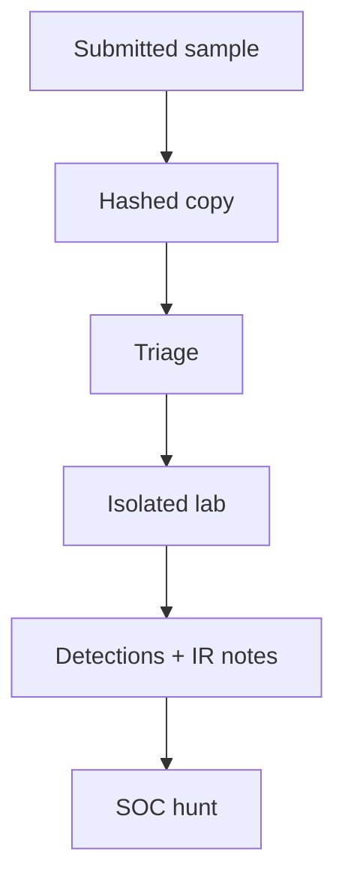

import { ConceptTemplate } from '@/features/kb/components/templates/ConceptTemplate'
import { Callout } from '@/features/kb/components/mdx/Callout'
import { ComparisonTable } from '@/features/kb/components/mdx/ComparisonTable'

export default function Layout({ children }) {
  return (
    <ConceptTemplate title="Malware Analysis">
      {children}
    </ConceptTemplate>
  )
}

**Malware analysis** is how responders learn what a sample does so they can write detections and judge impact. It is a **read-only investigation on copies in an isolated lab**. This page does not cover writing malware, packing it, or bypassing controls.

## 1. Deep Dive and Mechanics

**Triage.** Hash the sample, compare to known-good and known-bad sets, and note file type. Static notes (strings, imports, signer) stay on a copy. Dynamic notes (what it tries to touch) stay in a disposable VM with no production credentials and no open path to your real network.

**Output for the SOC.** Family name if known, persistence themes, C2 style at a high level, and **indicators you can hunt** (hashes, signer, unusual service names). The deliverable is a detection and a containment step, not a how-to.

**Safety.** Air-gapped or tightly egress-filtered lab. No shared home directory with your laptop. Legal review if samples include customer data.

<Callout icon="error" title="Never detonate on a production host">
Analysis VMs are cattle. Production is not a sandbox.
</Callout>

## 2. Mathematical / Theoretical Foundation

Classification is similarity search over features (hashes, fuzzy hashes, behavior graphs). Packed samples raise the cost of static reading; defenders then lean on behavior and reputation. The goal is a decision: benign, unwanted, or hostile — plus a confidence — not a complete decompile.

<ComparisonTable
  headers={['Mode', 'Question', 'Risk']}
  rows={[
    ['Hash / reputation', 'Have we seen this?', 'Low'],
    ['Static notes', 'What does it claim to import?', 'Low if copy-only'],
    ['Sandboxed run', 'What does it try to do?', 'Lab escape if sloppy'],
    ['Full RE', 'Why this family?', 'Time cost'],
  ]}
/>

## 3. Real-World Implementation

```text
# Analyst packet (defensive)
# Sample hash, source ticket, legal hold
# Lab VM snapshot id (no corp SSO)
# Findings: persistence theme, files touched, hunt queries
# Recommendation: isolate hosts, block signer / hash at EDR
```

Share IOCs through your intel platform, not as "fun" binaries in Slack.

## 4. Visualizations



## 5. Interview Prep

**Q: Why isolate the lab?**
**A:** Samples try to spread and to call home. Your analysis network must not be a launch pad.

**Q: Static vs dynamic?**
**A:** Static reads the file. Dynamic watches a run. Use both; trust neither alone.

**Q: What do you give the SOC?**
**A:** Huntables and containment, not a 40-page disassembly.

## 6. Production Use Cases

- **Phish attachment** triage for the mailbox team.
- **EDR unknown** binary that needs a family call.
- **Incident** scoping: which hosts saw the same hash.

<Callout icon="tip" title="Prefer vendor sandbox first">
Many samples are known. Do not spend a week on a commodity stealer.
</Callout>
