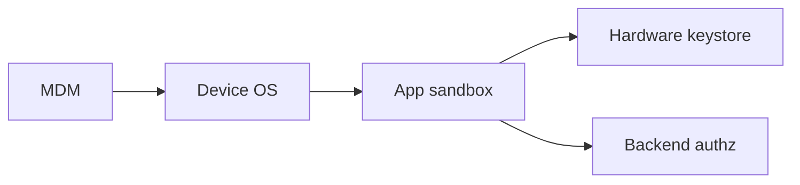

import { ConceptTemplate } from '@/features/kb/components/templates/ConceptTemplate'
import { Callout } from '@/features/kb/components/mdx/Callout'
import { ComparisonTable } from '@/features/kb/components/mdx/ComparisonTable'

export default function Layout({ children }) {
  return (
    <ConceptTemplate title="Mobile Security">
      {children}
    </ConceptTemplate>
  )
}

**Mobile security** covers the device (OS updates, MDM), the app (secure storage, ATS/App Transport), and the backend (the same authz rules as web). A phone is a computer with a store, biometrics, and a habit of backing photos up to someone else's cloud. Defense is **assume a lost device** and **do not store crown jewels in plaintext app storage**.

## 1. Deep Dive and Mechanics

**Platform.** Ship on current iOS/Android. Use the system keystore/Keychain. Certificate pin only with a backup pin and a plan to rotate. Refuse jailbroken/rooted devices for high-assurance apps if your threat model says so.

**App.** No secrets in the binary. Short-lived tokens. Biometric unlock wrapping a key, not "fingerprint means skip auth." Clear clipboard of secrets. Screenshot flags for banking screens.

**MDM / MAM.** Corporate mail and VPN on enrolled devices. Work profile on Android. Remote wipe. BYOD gets a container, not full-disk control you do not have.

<Callout icon="warning" title="The API is still the app">
A beautiful Keychain does not help if the same token works from curl without device checks you actually enforce.
</Callout>

## 2. Mathematical / Theoretical Foundation

Mobile threat models mix device possession, OS sandbox, and a hostile network (coffee-shop Wi-Fi). Hardware-backed keys (TEE/Secure Enclave) raise the cost of extraction. Attestation gives the server a signed statement about OS state — useful, spoofable if you only check a boolean on the client.

<ComparisonTable
  headers={['Store', 'Use', 'Avoid']}
  rows={[
    ['Keychain / Keystore', 'Refresh tokens, keys', 'Backups you did not encrypt'],
    ['Encrypted file', 'Cached records', 'Long-lived session files'],
    ['Binary / resource', 'Nothing secret', 'API keys'],
    ['WebView storage', 'Rarely', 'Session cookies for banking'],
  ]}
/>

## 3. Real-World Implementation

```text
# Mobile app baseline
# - TLS 1.2+ only, no cleartext HTTP
# - Tokens in Keychain/Keystore, not SharedPreferences plaintext
# - Certificate transparency / pinning with a pinset you can rotate
# - Server-side device or step-up checks for high-risk actions
```

Store listings and sideload policy are part of the threat model for Android.

## 4. Visualizations



## 5. Interview Prep

**Q: Why not hide the API key in the APK?**
**A:** Extraction is routine. Keys belong on the server.

**Q: MDM vs MAM?**
**A:** MDM manages the device. MAM manages the work app and its data on a device you may not own.

**Q: Is biometric auth enough?**
**A:** It unlocks a key. The server still needs a real session and step-up for transfers.

## 6. Production Use Cases

- **Banking apps** with hardware-backed keys and step-up.
- **Enterprise email** on enrolled devices only.
- **Field-service apps** with remote wipe and offline crypto.

<Callout icon="tip" title="Test on a lost-phone drill">
Revoke the session, wipe if enrolled, and confirm the backend refuses the old token.
</Callout>
