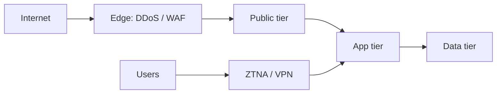

import { ConceptTemplate } from '@/features/kb/components/templates/ConceptTemplate'
import { Callout } from '@/features/kb/components/mdx/Callout'
import { ComparisonTable } from '@/features/kb/components/mdx/ComparisonTable'

export default function Layout({ children }) {
  return (
    <ConceptTemplate title="Network Security">
      {children}
    </ConceptTemplate>
  )
}

**Network security** is policy on paths: who may speak to whom, with which protocols, and what you log when they do. Firewalls, segmentation, VPN, DNS filtering, and IDS/IPS are tools. The discipline is **deny by default**, **encrypt in transit**, and **assume a hostile LAN** for anything that leaves the building.

## 1. Deep Dive and Mechanics

**Segment.** Users, servers, PCI, guests, and management planes do not share a flat L2. East-west allow-lists beat a hard shell and a soft chewy center.

**Filter.** Stateful firewalls and security groups at chokepoints. WAF and DDoS controls at the edge for public apps. No admin protocols on the public internet.

**Observe.** Flow logs, DNS logs, and IDS on the spans you can still see (after TLS, that is metadata plus a few inspected edges).

<Callout icon="info" title="Encryption moves the fight to identity">
TLS stops casual sniffing. It does not stop a stolen session or a permitted path to an admin API.
</Callout>

## 2. Mathematical / Theoretical Foundation

A network policy is a set of allow tuples (src, dst, port, proto, identity). The default is deny. Reachability analysis asks whether an unintended path exists after NAT, peering, and overlapping CIDRs. Zero Trust adds a principal and device posture to the tuple so IP alone is not enough.

<ComparisonTable
  headers={['Control', 'Question it answers', 'Limit']}
  rows={[
    ['Firewall / SG', 'May these IPs talk?', 'Stolen host inside the set'],
    ['Segmentation', 'How far can a breach walk?', 'Mis-peered VPCs'],
    ['VPN / ZTNA', 'Is the user on a trusted path?', 'Endpoint malware'],
    ['IDS', 'Does this look hostile?', 'Encrypted payload'],
  ]}
/>

## 3. Real-World Implementation

```text
# Reachability review
# - Management plane only from PAM / break-glass
# - No 0.0.0.0/0 on SSH or RDP
# - Flow logs on every VPC / VNet
# - Guest Wi-Fi cannot reach corp RFC1918
```

Draw the intended paths once a quarter. The diagram decays faster than the tickets.

## 4. Visualizations



## 5. Interview Prep

**Q: Firewall vs segmentation?**
**A:** A firewall is a checkpoint. Segmentation is the design that makes most paths not exist.

**Q: Why still do network security under Zero Trust?**
**A:** Identity-aware access still rides packets. You still need DDoS, egress control, and a place to put sensors.

**Q: East-west?**
**A:** Traffic between servers. That is where ransomware walks.

## 6. Production Use Cases

- **PCI and OT** enclaves with documented conduits.
- **Cloud VPCs** with private endpoints and no public RDS.
- **Campus** networks with 802.1X and guest isolation.

<Callout icon="tip" title="Log deny as well as allow">
The packet you dropped is often the first IOC.
</Callout>
