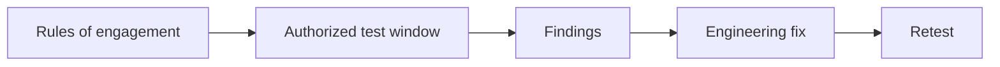

import { ConceptTemplate } from '@/features/kb/components/templates/ConceptTemplate'
import { Callout } from '@/features/kb/components/mdx/Callout'
import { ComparisonTable } from '@/features/kb/components/mdx/ComparisonTable'

export default function Layout({ children }) {
  return (
    <ConceptTemplate title="Penetration Testing">
      {children}
    </ConceptTemplate>
  )
}

A **penetration test** is a contracted, scoped review. Testers try to show impact against systems you named, in a window you approved, with a written rules of engagement. It is not a bug bounty, not a red-team covert op, and not a tutorial for breaking into networks. The product is a **prioritized report** your engineers can patch from.

## 1. Deep Dive and Mechanics

**Scope and rules.** In-scope assets, forbidden techniques (usually destructive testing, phishing unless bought), contacts, and a kill switch. Legal and change-control sign off first.

**Method at a high level.** Enumerate what the client already exposed, check whether known classes of weakness exist (authz, patch level, defaults), and demonstrate impact only as far as the rules allow. Stop at proof, not at "how far could we go for fun."

**Close-out.** Findings with severity, evidence stored as agreed, and a retest offer. The value is the fix, not the slide with a logo.

<Callout icon="warning" title="Authorization is the whole job">
Testing without a letter and a scope is just unauthorized access. That is a crime, not a career.
</Callout>

## 2. Mathematical / Theoretical Foundation

A pentest samples the vulnerability space under a budget of hours. Coverage is never complete. Severity should track business impact (data, authz, availability), not scanner CVSS alone. Residual risk after the test is "what we did not have time to touch," and an honest report says so.

<ComparisonTable
  headers={['Activity', 'Goal', 'Covert?']}
  rows={[
    ['Vulnerability scan', 'Known CVE inventory', 'No'],
    ['Pentest', 'Show impact in scope', 'Usually no'],
    ['Red team', 'Test detection of an objective', 'Yes'],
    ['Bug bounty', 'Ongoing external reports', 'No'],
  ]}
/>

## 3. Real-World Implementation

```markdown
# Rules of engagement sketch
# Customer: Example Corp
# Window: 2026-09-08 to 2026-09-19, business hours plus agreed
# In scope: *.app.example.com, staging VPC x
# Out of scope: destructive DoS, third-party IdP, physical
# Contacts: SOC 24/7, legal, engineering lead
# Deliverable: report + retest of criticals
```

Give testers accounts that match real roles so they can find broken access control, not just the login page.

## 4. Visualizations



## 5. Interview Prep

**Q: Pentest vs scan?**
**A:** A scan lists known issues. A pentest shows whether they chain into impact and whether business logic fails.

**Q: Why not test prod on Friday?**
**A:** Change risk. Prefer staging plus a thin, agreed prod check.

**Q: How do you pick a vendor?**
**A:** Scope literacy, safe harbor, and whether they write patchable findings.

## 6. Production Use Cases

- **Annual app and infra** tests for enterprise customers.
- **PCI** required assessments.
- **Pre-launch** reviews of a new money-movement flow.

<Callout icon="tip" title="Patch before you buy another test">
Repeating last year's unfixed criticals is theater.
</Callout>
