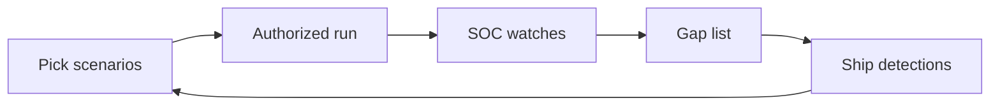

import { ConceptTemplate } from '@/features/kb/components/templates/ConceptTemplate'
import { Callout } from '@/features/kb/components/mdx/Callout'
import { ComparisonTable } from '@/features/kb/components/mdx/ComparisonTable'

export default function Layout({ children }) {
  return (
    <ConceptTemplate title="Purple Teaming">
      {children}
    </ConceptTemplate>
  )
}

**Purple teaming** is a collaborative drill. A small set of **authorized** scenarios is run while the SOC watches. The goal is better detections and playbooks, not a stealth trophy. If nobody shares timelines, you ran two monologues.

## 1. Deep Dive and Mechanics

Pick a few techniques mapped to a public framework (MITRE ATT&CK IDs as labels, not as a cookbook here). For each: what should fire, what did fire, time to detect, and the config change you will ship. Repeat until the gap list is short.

**Safety.** Same authorization as a pentest. Production data stays out of playgrounds. Use a lab or a canary tenant when you can.

**Output.** New or tighter detections, missing log sources, and training notes. A purple week that only produces a slide deck failed.

<Callout icon="info" title="Purple is a working agreement">
Red hides. Blue guesses. Purple puts both on the same timeline and scores the telemetry.
</Callout>

## 2. Mathematical / Theoretical Foundation

Each scenario is a hypothesis: if event class E occurs, detector D fires within T with false-positive rate below F. Purple teaming estimates those parameters on your stack, not on a vendor brochure. Coverage can be tracked as a matrix of techniques versus detections, knowing the matrix is never complete.

<ComparisonTable
  headers={['Mode', 'Information', 'Best outcome']}
  rows={[
    ['Red only', 'Hidden', 'Surprise findings'],
    ['Blue only', 'Alerts', 'Tuning in the dark'],
    ['Purple', 'Shared timeline', 'Detections that ship'],
    ['Tabletop', 'Talk only', 'Comms practice'],
  ]}
/>

## 3. Real-World Implementation

```text
# Scenario card
# ATT&CK label: credential access (category only)
# Expected logs: IdP risk, EDR process, VPN
# Expected alert: "impossible travel" or "token from new ASN"
# Result: fired / missed / too noisy
# Owner + ship date for the fix
```

Keep raw offensive tooling notes out of the wiki the whole company can read.

## 4. Visualizations



## 5. Interview Prep

**Q: Why not only red team?**
**A:** Covert tests measure surprise. Purple measures whether you can see a known story. You want both over a year.

**Q: How many scenarios?**
**A:** A handful done well beats a catalog nobody tuned.

**Q: Who leads?**
**A:** A facilitator who can stop the exercise and who owns the gap list.

## 6. Production Use Cases

- **New EDR** onboarding weeks.
- **Detection engineering** sprints after a missed incident.
- **Regulated orgs** that must show control testing, not only a pentest PDF.

<Callout icon="tip" title="Score time-to-detect, not ego">
If the SOC saw it in two minutes, write that down and move to the next gap.
</Callout>
