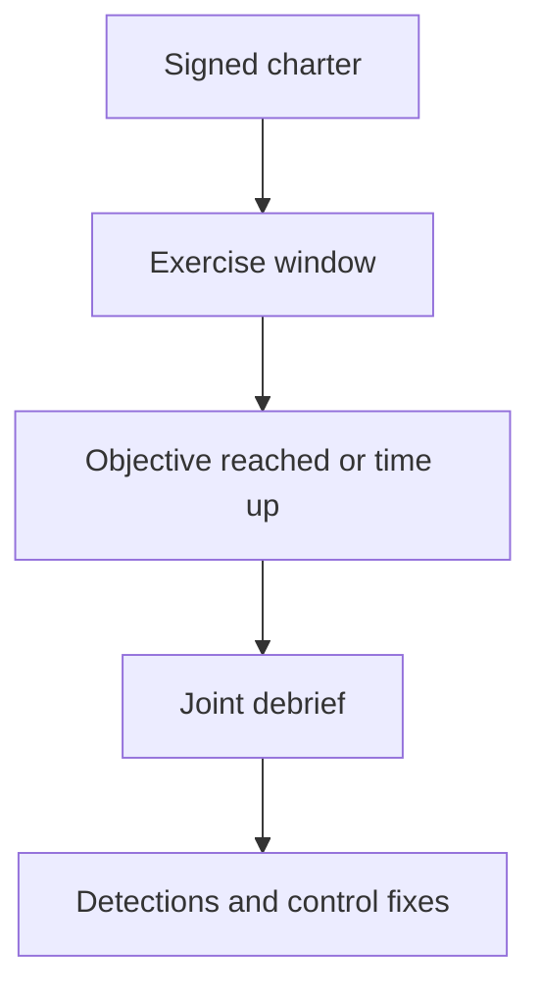

import { ConceptTemplate } from '@/features/kb/components/templates/ConceptTemplate'
import { Callout } from '@/features/kb/components/mdx/Callout'
import { ComparisonTable } from '@/features/kb/components/mdx/ComparisonTable'

export default function Layout({ children }) {
  return (
    <ConceptTemplate title="Red Teaming">
      {children}
    </ConceptTemplate>
  )
}

**Red teaming** (when done legally) is a **covert-to-the-SOC, overt-to-leadership** exercise. The team has written authorization, a defined objective (for example, reach a dummy crown-jewel record), and stop rules. The point is to measure **dwell time and response quality**, not to publish attack recipes. This page stays at that management and defensive level.

## 1. Deep Dive and Mechanics

**Charter.** Sponsor, objective, in/out of scope, emergency stop, and whether physical or social vectors are purchased. Legal and HR must sign social-engineering scopes.

**During.** The red cell works toward the objective while a trusted agent can halt them. The blue cell is not handed a live play-by-play (that would be purple). Evidence is kept for the debrief.

**After.** A timeline vs detections, missed log sources, and a remediation program. A red team that only "got domain admin" and leaves no detection work did half a job.

<Callout icon="error" title="No authorization, no red team">
Covert action against systems you do not own is a crime. Internal heroics without a charter are also out of bounds.
</Callout>

## 2. Mathematical / Theoretical Foundation

The exercise is a sample from an enormous adversary strategy space. Success/fail on one objective is a biased estimator of resilience. Useful metrics: time to first reliable detect, time to contain, and fraction of critical path steps that were visible in telemetry. Kill-chain language is a **narrative scaffold for the debrief**, not a how-to.

<ComparisonTable
  headers={['Exercise', 'Primary customer', 'Success looks like']}
  rows={[
    ['Pentest', 'Engineering', 'Patchable findings'],
    ['Red team', 'SOC + leadership', 'Honest detect/respond gaps'],
    ['Purple', 'Detection eng', 'Shipped rules'],
    ['Tabletop', 'Exec comms', 'Decisions under a script'],
  ]}
/>

## 3. Real-World Implementation

```markdown
# Charter sketch
# Objective: access a staged "crown jewel" dataset in lab-prod
# In scope: named corp laptops and the staging VPC
# Out of scope: destructive actions, real customer PII, third parties
# Trusted agent: CISO on-call with halt authority
# Debrief: timeline vs SOC tickets within 10 business days
```

Use canary files and staged data so "success" does not mean real exfiltration.

## 4. Visualizations



## 5. Interview Prep

**Q: Red vs pentest?**
**A:** Pentest maximizes findings in a known scope. Red tests whether the org notices an objective-driven story.

**Q: Should the SOC know?**
**A:** Usually no, except a trusted agent. That is the measurement.

**Q: What if they "win"?**
**A:** You buy a prioritized gap list. You do not conclude the company is doomed or the testers are magicians.

## 6. Production Use Cases

- **Mature SOCs** that already patch pentest findings.
- **Board-level** assurance after a large control investment.
- **M&A** environments that need a detection reality check.

<Callout icon="tip" title="Fund the fixes">
If the debrief has no budget, you bought expensive theater.
</Callout>
