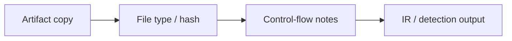

import { ConceptTemplate } from '@/features/kb/components/templates/ConceptTemplate'
import { Callout } from '@/features/kb/components/mdx/Callout'
import { ComparisonTable } from '@/features/kb/components/mdx/ComparisonTable'

export default function Layout({ children }) {
  return (
    <ConceptTemplate title="Reverse Engineering">
      {children}
    </ConceptTemplate>
  )
}

**Reverse engineering (RE)** is recovering design from artifacts: a binary, a firmware image, a closed protocol. In a security org it is a **defensive skill** for malware triage, vulnerability intake, and compatibility. This page does not cover cracking licenses, defeating protections for piracy, or building exploits.

## 1. Deep Dive and Mechanics

Analysts work on **copies** in a lab. They identify compiler, architecture, and libraries; recover control flow at a high level; and write notes the SOC can use (family, persistence theme, unique strings). Time-box: a commodity sample does not deserve a week of decompile.

**Legal.** License, CFAA, and contract terms matter. RE of your own malware sample or your own product is a different world from RE of a competitor's DRM.

**Pair with policy.** If the question is "do we have a CVE in this driver," you may want the vendor and a patch, not a full RE.

<Callout icon="warning" title="RE is not exploit development">
Understanding a crash is a patch and a mitigation. Turning it into a weapon is out of scope for this knowledge base.
</Callout>

## 2. Mathematical / Theoretical Foundation

A compiled program is a lossy compilation of source. Disassembly is an undecidable problem in the limit (self-modifying code, opaque predicates). In practice, tools recover a good-enough CFG. Type recovery and decompilation are heuristics. Defenders optimize for **decision value per hour**, not perfect source.

<ComparisonTable
  headers={['Need', 'Depth', 'Stop when']}
  rows={[
    ['IOC for SOC', 'Shallow', 'Stable hash / signer / URL pattern'],
    ['Impact for IR', 'Medium', 'You know what data it touched'],
    ['Patch a crash', 'Targeted', 'Root cause and fix'],
    ['Full rewrite', 'Deep', 'Rarely justified'],
  ]}
/>

## 3. Real-World Implementation

```text
# Lab notes template
# Hash, file type, signer, first-seen ticket
# High-level behavior (category): persistence / steal / ransomware
# Huntables to export
# Do not store unpacked samples on corp file shares
```

Keep tools and samples off everyday laptops.

## 4. Visualizations



## 5. Interview Prep

**Q: When do you RE vs just reimage?**
**A:** RE when the family is unknown and impact is unclear. Reimage when the host is cattle and telemetry is enough.

**Q: Ghidra vs IDA?**
**A:** Both are disassemblers/decompilers. Pick the one your team can license and script. The process matters more than the logo.

**Q: Is RE legal?**
**A:** It depends on jurisdiction, contract, and purpose. Security teams involve legal for third-party binaries.

## 6. Production Use Cases

- **Malware intake** for unique samples.
- **Vendor-dead firmware** you must still support safely.
- **Protocol notes** for a legacy plant system you own.

<Callout icon="tip" title="Write the hunt query first">
If RE will not change detection or containment, stop.
</Callout>
