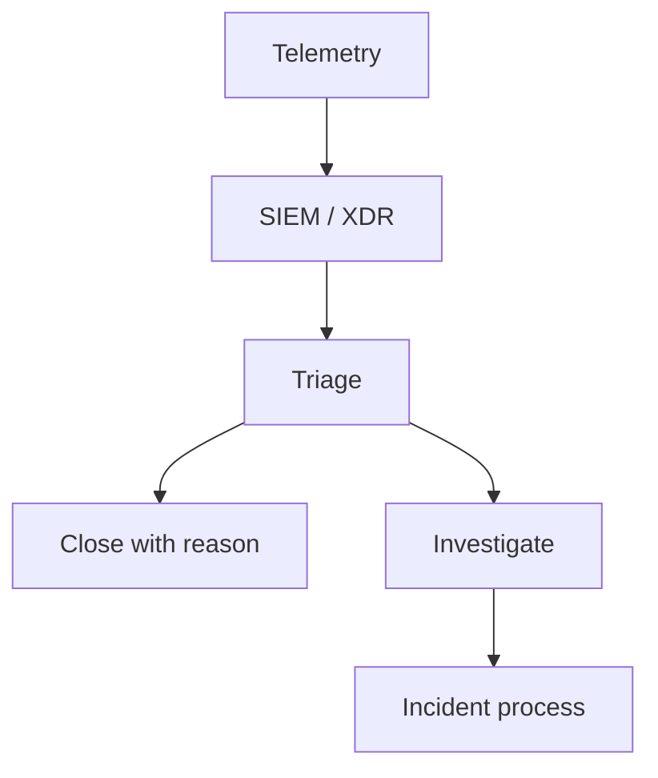

import { ConceptTemplate } from '@/features/kb/components/templates/ConceptTemplate'
import { Callout } from '@/features/kb/components/mdx/Callout'
import { ComparisonTable } from '@/features/kb/components/mdx/ComparisonTable'

export default function Layout({ children }) {
  return (
    <ConceptTemplate title="SOC Operations">
      {children}
    </ConceptTemplate>
  )
}

A **Security Operations Center (SOC)** watches alerts, hunts, and drives IR. It is a factory for decisions: ignore, ticket, or incident. Tools (SIEM, EDR, SOAR) are inputs. The scarce resource is **attentive humans** and a queue that is not 95 percent junk.

## 1. Deep Dive and Mechanics

**Triage.** Enrich the alert (asset owner, user, geo, recent changes). Check allow-lists and maintenance windows. Close with a reason or escalate with a story.

**Use cases.** Each detection has an owner, a runbook, and a false-positive budget. If a rule cannot be actioned, tune it or drop it.

**Shifts and burnout.** Follow-the-sun or on-call. Measure time-to-acknowledge, not only MTTD vanity. Rotate hunts so people still think.

<Callout icon="warning" title="A SIEM is not a SOC">
Without runbooks, asset context, and authority to isolate, you have an expensive log search.
</Callout>

## 2. Mathematical / Theoretical Foundation

Alert volume is arrival vs service rate. If lambda exceeds mu, queues explode and people click "close." Detection quality is precision/recall against a labeled set you rarely have; in practice you track close reasons and re-open rates. Automation should handle the high-precision tail (disable a known-bad token), not the ambiguous middle.

<ComparisonTable
  headers={['Tier', 'Work', 'Needs']}
  rows={[
    ['L1', 'Triage and known playbooks', 'Context + runbooks'],
    ['L2', 'Investigations', 'Forensics access'],
    ['L3 / DET', 'New detections, hunts', 'Engineering time'],
    ['IR', 'Declared incidents', 'Commander + comms'],
  ]}
/>

## 3. Real-World Implementation

```text
# Use-case record
# Name: impossible travel on IdP
# Data: IdP risk + VPN + EDR
# Action if true: revoke sessions, open IR sev2
# Tune if: corporate travel calendar match
# Owner: identity detections
```

SOAR can open the ticket and enrich. A human still owns the isolate button for messy cases.

## 4. Visualizations



## 5. Interview Prep

**Q: MSSP vs internal SOC?**
**A:** MSSP scales watching. You still own context, authority, and the crown jewels. Hybrid is common.

**Q: How do you cut noise?**
**A:** Kill rules that never become incidents. Add asset context. Fix the product that pages 400 times.

**Q: Hunt vs alert?**
**A:** Alerts are push. Hunts are pull hypotheses. Both need a hypothesis and an output.

## 6. Production Use Cases

- **24/7 enterprise SOC** with EDR + IdP + email.
- **Cloud-first** SOC that lives in the provider and IdP consoles.
- **OT/IT** split queues with different isolate rules.

<Callout icon="tip" title="Close reasons are gold">
If 80 percent of a rule is "expected scanner," change the rule, not the people.
</Callout>
