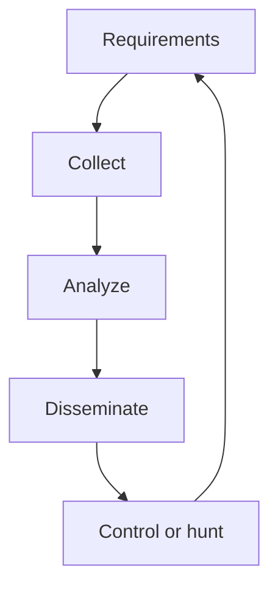

import { ConceptTemplate } from '@/features/kb/components/templates/ConceptTemplate'
import { Callout } from '@/features/kb/components/mdx/Callout'
import { ComparisonTable } from '@/features/kb/components/mdx/ComparisonTable'

export default function Layout({ children }) {
  return (
    <ConceptTemplate title="Threat Intelligence">
      {children}
    </ConceptTemplate>
  )
}

**Threat intelligence (TI)** is not a firehose of IPs. It is a statement such as: this actor targets our sector with this theme, so we prioritize these patches and these detections. If nobody changed a control, you collected trivia.

## 1. Deep Dive and Mechanics

**Levels.** Strategic (who and why, for leadership). Operational (campaigns). Tactical (TTPs). Technical (IOCs with TTLs). Most orgs drown in the last and skip the first.

**Lifecycle.** Requirements from IR and product ("do we care about this ransomware family?"), collection from ISACs and vendors, analysis, dissemination in a form a control owner can use, then feedback.

**Quality.** Source, confidence, and expiry. A raw IP from a public list is a maybe. A hash tied to a ticket you already have is gold.

<Callout icon="warning" title="IOC-only intel expires yesterday">
Addresses and filenames rotate. Behaviors and asset priorities last longer.
</Callout>

## 2. Mathematical / Theoretical Foundation

An IOC is a high-precision, low-recall feature. TTP mappings (ATT&CK) are a coarse ontology so you can score coverage. Utility is P(decision change | intel). Bayesian updating is the honest model; traffic-light confidence is the practical one. Sharing communities work when legal lanes (TLP) are respected.

<ComparisonTable
  headers={['Product', 'Audience', 'Example action']}
  rows={[
    ['Strategic brief', 'Exec', 'Budget a control'],
    ['Campaign note', 'SOC / IR', 'Watch a theme'],
    ['TTP note', 'Detection eng', 'Write or tune a rule'],
    ['IOC bundle', 'Controls', 'Block with a TTL'],
  ]}
/>

## 3. Real-World Implementation

```text
# Intel requirement
# Who: payments org
# Question: which ransomware families hit our sector this quarter?
# Output: top 3 + the backups and IdP controls they imply
# Not: 50k IPs in a CSV nobody will expire
```

Feed IOCs into the SIEM with an expiry and a source field, or do not feed them.

## 4. Visualizations



## 5. Interview Prep

**Q: Intel vs vulnerability management?**
**A:** VM is your CVE backlog. Intel tells you which threats make some CVEs urgent for you.

**Q: What is TLP?**
**A:** Traffic Light Protocol: how far a share may travel. Breaking TLP ends trust.

**Q: Do we need a dedicated intel team?**
**A:** Not at small scale. You need a named consumer and a 30-minute weekly brief.

## 6. Production Use Cases

- **Sector ISAC** membership with a human who reads it.
- **IR enrichment** during an active incident.
- **Board papers** that name relevant actors without fanfic.

<Callout icon="tip" title="Write requirements before buying a feed">
A feed without a question is unread mail.
</Callout>
