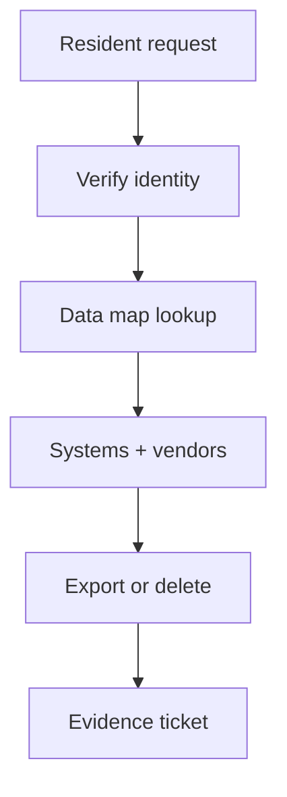

import { ConceptTemplate } from '@/features/kb/components/templates/ConceptTemplate'
import { Callout } from '@/features/kb/components/mdx/Callout'
import { ComparisonTable } from '@/features/kb/components/mdx/ComparisonTable'

export default function Layout({ children }) {
  return (
    <ConceptTemplate title="CCPA / CPRA">
      {children}
    </ConceptTemplate>
  )
}

The **California Consumer Privacy Act (CCPA)**, expanded by **CPRA**, is a state privacy statute. It is not a security standard like SOC 2. It grants residents rights (know, delete, correct, opt out of sale/share) and requires businesses over a size or data threshold to disclose practices and honor requests. Security teams care because **you cannot fulfill a delete if you cannot find the data**.

## 1. Deep Dive and Mechanics

**Who.** For-profit businesses that meet revenue, records, or share-of-revenue tests, plus vendors who process for them. Employee and B2B data have had shifting coverage — read the current text, do not rely on 2018 blog posts.

**Rights operations.** A request lands, you verify identity without creating a new breach, you find every system of record, you delete or export, and you tell service providers to do the same. "Sale" and "share" include many ad-tech cookies, not only a cash invoice.

**Security.** Reasonable security is expected. A breach of unencrypted personal information has notice and AG dynamics. Encryption, access control, and a data map are the engineering half.

<Callout icon="info" title="CCPA is not GDPR with palm trees">
Definitions, thresholds, and private right of action differ. Do not copy-paste an EU RoPA and call it done.
</Callout>

## 2. Mathematical / Theoretical Foundation

Privacy compliance is a data-lineage problem: for each personal-information category, list purposes, processors, retention, and deletion method. Completeness of the map bounds your legal risk more than the font on the privacy policy. Identity verification is a security vs usability trade: too weak leaks data to impostors; too strong denies the real resident.

<ComparisonTable
  headers={['Duty', 'Engineering need', 'Failure']}
  rows={[
    ['Know / access', 'Export by person key', 'Shadow SaaS'],
    ['Delete', 'Hard delete + vendor fan-out', 'Backups forever unlabeled'],
    ['Opt-out sale/share', 'Consent and cookie plumbing', 'Pixels you forgot'],
    ['Reasonable security', 'Encryption, IAM, IR', 'Public bucket of PI'],
  ]}
/>

## 3. Real-World Implementation

```text
# Request runbook
# 1. Verify the requester (do not email the full export to an unchecked address)
# 2. Query the data map: CRM, billing, logs, warehouse, vendors
# 3. Apply delete or export; record ticket id and systems touched
# 4. Set a calendar reminder for backup expiry
```

Treat marketing pixels as processors. If you cannot name them, you cannot honor opt-out.

## 4. Visualizations



## 5. Interview Prep

**Q: CCPA vs GDPR?**
**A:** Both are privacy laws. GDPR is EU, lawful-basis heavy. CCPA is California, consumer-rights and notice heavy, with different thresholds.

**Q: Do logs count?**
**A:** Often yes if they can identify a person. Retention and deletion design must include them.

**Q: What is CPRA?**
**A:** The ballot upgrade: more rights, an agency (CPPA), and sensitive-PI rules.

## 6. Production Use Cases

- **Consumer apps** with California users and ad tech.
- **Data warehouses** that must support subject deletion.
- **Vendor contracts** that flow down deletion SLAs.

<Callout icon="tip" title="Build the data map before the inbox opens">
A privacy portal without lineage is a promise you will break.
</Callout>
