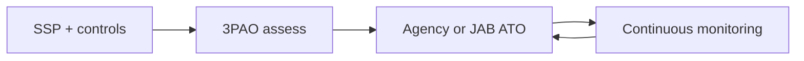

import { ConceptTemplate } from '@/features/kb/components/templates/ConceptTemplate'
import { Callout } from '@/features/kb/components/mdx/Callout'
import { ComparisonTable } from '@/features/kb/components/mdx/ComparisonTable'

export default function Layout({ children }) {
  return (
    <ConceptTemplate title="FedRAMP">
      {children}
    </ConceptTemplate>
  )
}

**FedRAMP** (Federal Risk and Authorization Management Program) is how U.S. federal agencies buy cloud with a repeatable security review. A Cloud Service Provider (CSP) implements NIST 800-53 controls at a baseline (Low, Moderate, High, plus LI-SaaS), gets assessed by a 3PAO, and receives an authorization. It is a **package and a continuous-monitoring job**, not a sticker you print once.

## 1. Deep Dive and Mechanics

**Authorize.** You pick a baseline, write a System Security Plan, implement controls, and sit an assessment. An agency or the JAB issues an ATO. Other agencies can reuse the package (the point of the program).

**Operate.** Monthly/annual deliverables: vulnerability scans, inventory, significant-change reports, and POA&Ms for open items. A quiet "we shipped a new region" can be a significant change.

**Boundary.** What is in the FedRAMP system vs corporate IT must be drawn. Corporate laptops that admin the cloud are in scope whether you like it or not.

<Callout icon="warning" title="Authorization is a living boundary">
If prod and the CI that can prod-deploy are different worlds on paper but the same keys in life, the assessor will notice.
</Callout>

## 2. Mathematical / Theoretical Foundation

FedRAMP is a control catalog (800-53) plus an assurance process (assess, authorize, monitor). Residual risk is tracked as POA&Ms with dates. Inheritance (IaaS under PaaS) is a composition of authorizations. The security claim is "meets the baseline as assessed," not "unhackable."

<ComparisonTable
  headers={['Baseline', 'Typical use', 'Effort']}
  rows={[
    ['LI-SaaS', 'Low-impact SaaS', 'Smallest'],
    ['Low', 'Limited data', 'Small'],
    ['Moderate', 'Most civilian SaaS', 'Default large'],
    ['High', 'Sensitive missions', 'Largest'],
  ]}
/>

## 3. Real-World Implementation

```text
# Continuous monitoring pack (conceptual)
# - Monthly authenticated vuln scans of the boundary
# - Inventory diff vs last month
# - POA&M updates with owners and dates
# - Incident notifications per the agency SLA
```

Engineers should see FedRAMP change control as the same pipeline as prod, with extra evidence attached.

## 4. Visualizations



## 5. Interview Prep

**Q: FedRAMP vs SOC 2?**
**A:** SOC 2 is a CPA attestation to a customer. FedRAMP is a government authorization against 800-53 with ongoing scans.

**Q: What is a 3PAO?**
**A:** A Third Party Assessment Organization accredited to test the package.

**Q: Why do people say FedRAMP is hard?**
**A:** Evidence volume, change control, and the boundary including admin paths.

## 6. Production Use Cases

- **SaaS** sold to U.S. civilian agencies.
- **IaaS regions** that other CSPs inherit.
- **Gov cloud** partitions with separate IdP and keys.

<Callout icon="tip" title="Design the boundary on day one">
Retrofitting logging and admin isolation after the first agency deal is the expensive path.
</Callout>
