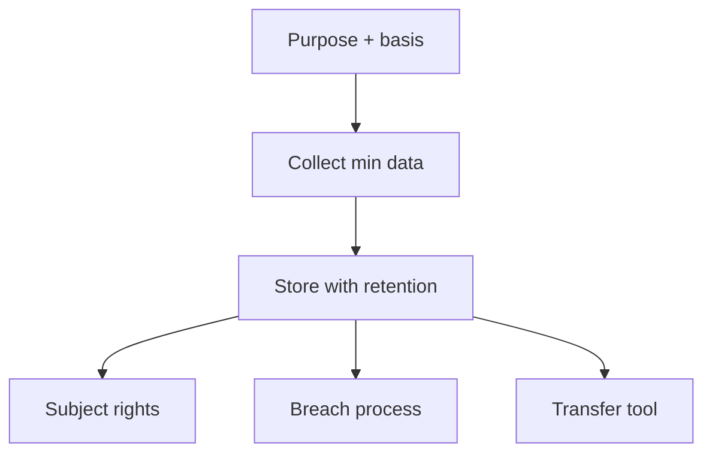

import { ConceptTemplate } from '@/features/kb/components/templates/ConceptTemplate'
import { Callout } from '@/features/kb/components/mdx/Callout'
import { ComparisonTable } from '@/features/kb/components/mdx/ComparisonTable'

export default function Layout({ children }) {
  return (
    <ConceptTemplate title="GDPR">
      {children}
    </ConceptTemplate>
  )
}

**GDPR** is the European Union's primary personal-data law. It applies to organizations in the EU and to many outside that offer goods or monitor people in the EU. It is a **lawful-basis and rights** regime, not a firewall checklist. Security is required as "appropriate technical and organisational measures," including breach notice (typically 72 hours to a supervisory authority when required).

## 1. Deep Dive and Mechanics

**Principles.** Lawfulness, fairness, transparency, purpose limitation, data minimisation, accuracy, storage limitation, integrity/confidentiality, and accountability.

**Roles.** A controller decides purposes. A processor acts on documented instructions. Both need contracts (DPA) and a path for subject rights.

**Rights and transfers.** Access, delete, restrict, portability, object. Transfers out of the EU need a mechanism (SCCs, adequacy, and a transfer assessment). Cookies and tracking are their own headache (ePrivacy plus GDPR).

<Callout icon="warning" title="Legitimate interest is not a magic word">
You still balance, document, and offer an opt-out where required. "We wanted analytics" is not a complete LIA.
</Callout>

## 2. Mathematical / Theoretical Foundation

GDPR risk is often framed as a DPIA: likelihood and severity of impact on people, not only on the company. Minimisation is an information-theory instinct: collect fewer identifying fields. Pseudonymisation and encryption are mitigations, not exemptions from being personal data. Accountability means you can show the record of processing, not only claim you are careful.

<ComparisonTable
  headers={['Concept', 'Means', 'Engineering hook']}
  rows={[
    ['Lawful basis', 'Why you may process', 'Flags in the data model'],
    ['Minimisation', 'Only needed fields', 'Schema and logs'],
    ['DPO / ROPA', 'Governance artifacts', 'System inventory'],
    ['72h notice', 'Authority clock', 'IR playbook'],
  ]}
/>

## 3. Real-World Implementation

```text
# Product privacy checklist
# - Named lawful basis per purpose
# - Retention on every store (including logs and backups)
# - Export/delete API keyed by user id
# - Subprocessor list and DPA in the procurement path
```

Do not keep "just in case" email dumps of EU customers in a personal Drive.

## 4. Visualizations



## 5. Interview Prep

**Q: Controller vs processor?**
**A:** Controller decides why. Processor follows instructions. A SaaS is often processor for customer content and controller for its own billing.

**Q: Is a hash still personal data?**
**A:** If it can be linked back to a person, treat it as personal. Salted hashes can still be personal data.

**Q: What is a DPIA?**
**A:** A documented high-risk processing assessment you do before you scale the risky thing.

## 6. Production Use Cases

- **Global SaaS** with EU tenants.
- **Marketing stacks** with consent and suppression.
- **HR systems** for EU employees.

<Callout icon="tip" title="Put retention in the table definition">
A column without a TTL becomes a forever archive.
</Callout>
