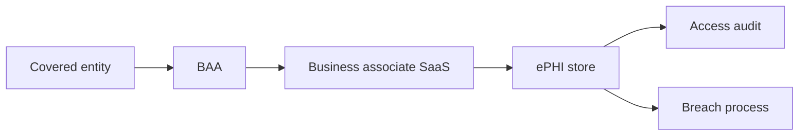

import { ConceptTemplate } from '@/features/kb/components/templates/ConceptTemplate'
import { Callout } from '@/features/kb/components/mdx/Callout'
import { ComparisonTable } from '@/features/kb/components/mdx/ComparisonTable'

export default function Layout({ children }) {
  return (
    <ConceptTemplate title="HIPAA">
      {children}
    </ConceptTemplate>
  )
}

**HIPAA** (Health Insurance Portability and Accountability Act) plus the HITECH updates govern **protected health information (PHI)** in the U.S. Covered entities (providers, plans, clearinghouses) and **business associates** (SaaS that touches PHI) must implement the Privacy, Security, and Breach Notification Rules. Encrypting a disk is necessary and not sufficient.

## 1. Deep Dive and Mechanics

**Privacy Rule.** Minimum necessary, uses and disclosures, patient rights, notices. Engineering sees this as "role-based access and audit who viewed a chart."

**Security Rule.** Administrative, physical, and technical safeguards that are required or addressable. Addressable does not mean optional; it means document why an alternative is equivalent.

**Breach.** Unauthorized use or disclosure of unsecured PHI. Encryption safe harbor exists when implemented to NIST-class standards. BAAs must flow to subcontractors.

<Callout icon="error" title="No BAA, no PHI">
A clever startup Slack channel is not a covered environment. If the vendor will not sign a BAA, do not put PHI there.
</Callout>

## 2. Mathematical / Theoretical Foundation

HIPAA security is a risk-analysis obligation (identify ePHI, threats, controls, residual risk), not a single product. "Addressable" controls are a documented decision record. Minimum necessary is a least-privilege rule over data fields, not only over VPN access. Audit logs must be attributable to a person, which forbids shared workstations without a story.

<ComparisonTable
  headers={['Rule', 'Core ask', 'Typical control']}
  rows={[
    ['Privacy', 'Who may see PHI', 'RBAC, min necessary'],
    ['Security', 'How ePHI is protected', 'MFA, encryption, audit'],
    ['Breach notify', 'When to tell people', 'IR clock + legal'],
    ['BAA', 'Vendor duty', 'Contract + equivalent safeguards'],
  ]}
/>

## 3. Real-World Implementation

```text
# ePHI system baseline
# - Unique user IDs, MFA, automatic logoff
# - Encryption in transit and at rest
# - Audit of view/export; alerts on bulk access
# - BAA + BA inventory before go-live
```

Access reviews for clinicians who changed departments are as important as TLS.

## 4. Visualizations



## 5. Interview Prep

**Q: Covered entity vs BA?**
**A:** The hospital is usually a CE. The cloud EHR or billing SaaS is a BA and needs a BAA.

**Q: Addressable encryption?**
**A:** If you skip it, you must document an equivalent. In 2026, "we skipped encryption" is a hard sell.

**Q: Is de-identified data free of HIPAA?**
**A:** Expert determination or Safe Harbor de-identification is a specific process. "We dropped the name column" is often still PHI.

## 6. Production Use Cases

- **EHR and telehealth** platforms.
- **Claims and billing** processors.
- **Research** pipelines that still hold identifiers.

<Callout icon="tip" title="Log the break-glass">
Emergency access must exist for care. It must also page someone.
</Callout>
