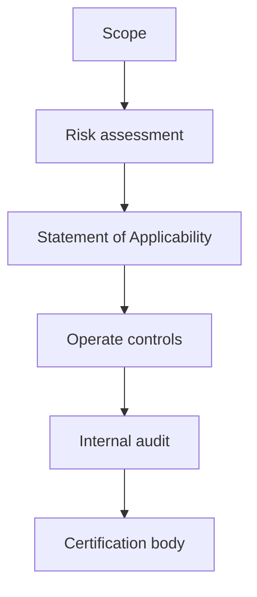

import { ConceptTemplate } from '@/features/kb/components/templates/ConceptTemplate'
import { Callout } from '@/features/kb/components/mdx/Callout'
import { ComparisonTable } from '@/features/kb/components/mdx/ComparisonTable'

export default function Layout({ children }) {
  return (
    <ConceptTemplate title="ISO/IEC 27001">
      {children}
    </ConceptTemplate>
  )
}

**ISO/IEC 27001** is the standard for an **Information Security Management System (ISMS)**. You define scope, assess risk, pick controls (Annex A, aligned with 27002), run the PDCA loop, and a certification body audits you. The certificate says you have a managed system. It does not say a particular product is bug-free.

## 1. Deep Dive and Mechanics

**Scope.** Legal entities, locations, and systems in the ISMS. A narrow scope is honest if sales does not claim the whole company.

**Risk and SoA.** Risk assessment leads to a Statement of Applicability: which Annex A controls you use and why some are excluded. Then you operate them: access reviews, supplier reviews, incident process, secure development.

**Audit.** Stage 1 (readiness) and Stage 2 (certification), then surveillance years. Internal audit and management review are not optional theater.

<Callout icon="info" title="Annex A is a menu, not a shopping list">
You select controls from risk. Copying 93 controls into a wiki with no owners is not an ISMS.
</Callout>

## 2. Mathematical / Theoretical Foundation

ISO 27001 is a management-system standard (Plan-Do-Check-Act) wrapped around a control catalog. Residual risk after treatment is accepted by a named role. Certification is a sampling assurance process: auditors test a sample of controls and evidence. The security claim is process existence and operation, not exhaustive technical proof.

<ComparisonTable
  headers={['Artifact', 'Purpose', 'Owner']}
  rows={[
    ['Scope', 'What is certified', 'CISO / exec'],
    ['Risk register', 'Why controls exist', 'Risk owner'],
    ['SoA', 'Control selection', 'ISMS lead'],
    ['Internal audit', 'Check the system', 'Independent of ops'],
  ]}
/>

## 3. Real-World Implementation

```text
# Lightweight ISMS loop
# - Quarterly risk review
# - Monthly access and vuln metrics
# - Annual internal audit + management review
# - Supplier list with security questionnaires on a cadence
```

Tie tickets to control IDs so evidence is a query, not a scavenger hunt.

## 4. Visualizations



## 5. Interview Prep

**Q: 27001 vs 27002?**
**A:** 27001 is the certifiable ISMS. 27002 is guidance on how controls look.

**Q: 27001 vs SOC 2?**
**A:** Both are assurance. 27001 is an international management standard. SOC 2 is an AICPA attestation on Trust Services Criteria.

**Q: Can a startup pass?**
**A:** Yes if scope is honest and evidence is real. Headcount is not the blocker; chaos is.

## 6. Production Use Cases

- **Enterprise sales** that require a certificate.
- **Multi-country** groups that want one ISMS language.
- **Suppliers** who must show a certified ISMS to a regulator.

<Callout icon="tip" title="Scope the product you sell first">
Certifying the cafeteria Wi-Fi and forgetting the SaaS is a common comedy.
</Callout>
