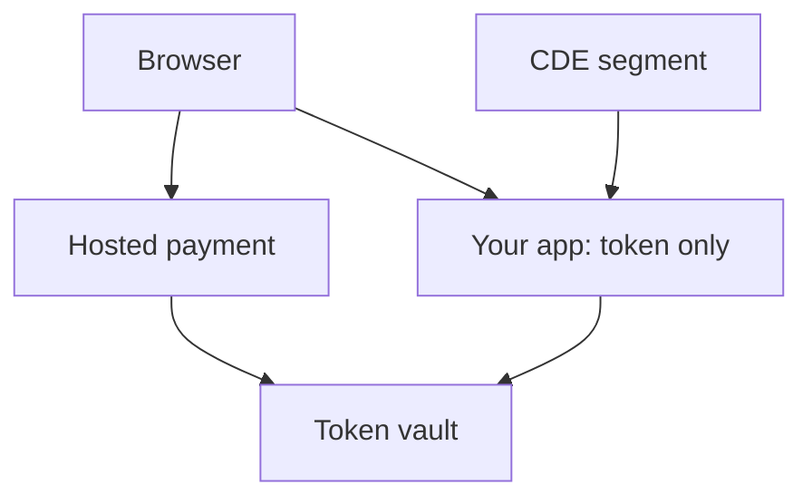

import { ConceptTemplate } from '@/features/kb/components/templates/ConceptTemplate'
import { Callout } from '@/features/kb/components/mdx/Callout'
import { ComparisonTable } from '@/features/kb/components/mdx/ComparisonTable'

export default function Layout({ children }) {
  return (
    <ConceptTemplate title="PCI DSS">
      {children}
    </ConceptTemplate>
  )
}

**PCI DSS** is a contractual standard from the PCI Security Standards Council. If you store, process, or transmit **cardholder data (CHD)** or **sensitive authentication data**, you are in the cardholder data environment (CDE) and must meet the current DSS (v4.x). The cheapest control is often **not having the data**: a hosted payment field or token vault shrinks scope.

## 1. Deep Dive and Mechanics

**Scope.** Systems that touch CHD and systems connected to them. Segmentation that actually works can shrink the CDE. Flat networks make the whole estate in scope.

**Requirements.** Network controls, hardening, protect stored data, encryption in transit, anti-malware, secure development, access control, unique IDs, physical, logging, testing, and a policy pack. v4.x emphasizes customized approaches and stronger MFA and phishing-resistant options for CDE access.

**Assess.** SAQ vs ROC depends on volume and how you take cards. QSAs assess larger merchants and service providers.

<Callout icon="error" title="Logs and admin laptops are in scope if they can reach the CDE">
A jump box with CHD screenshots in a ticket is still card data.
</Callout>

## 2. Mathematical / Theoretical Foundation

Scope is a reachability and data-flow graph. If CHD bytes can land on a host, that host is in. PAN storage constraints (render, hash, truncate, encrypt with documented key management) are applied crypto, not "we zipped it." Compensating controls must meet the intent and be extra, not a shrug.

<ComparisonTable
  headers={['Approach', 'CHD on your box?', 'Typical SAQ / ROC']}
  rows={[
    ['Redirect / hosted field', 'No', 'Shorter SAQ'],
    ['Tokenize after auth', 'Transient only', 'Smaller CDE'],
    ['Store PAN', 'Yes', 'Full controls + keys'],
    ['Service provider', 'Yes for customers', 'ROC common'],
  ]}
/>

## 3. Real-World Implementation

```text
# Scope reduction
# - Hosted payment page; your app stores only a token
# - CDE in a separate VPC with deny-all peering
# - Admin via PAM with MFA; no email on CDE jump hosts
# - Quarterly ASV scans and documented pentest
```

Never keep magnetic-stripe or CVV data after authorization. That is forbidden storage, not a setting.

## 4. Visualizations



## 5. Interview Prep

**Q: What is the CDE?**
**A:** The people, process, and tech that store, process, or transmit CHD, plus connected systems that can affect it.

**Q: Why tokenize?**
**A:** Tokens are not PANs. Most of your CRM falls out of scope if the flow is honest.

**Q: SAQ vs ROC?**
**A:** Self-Assessment Questionnaire vs a Report on Compliance signed by a QSA. Volume and role decide.

## 6. Production Use Cases

- **E-commerce** with a hosted checkout.
- **Payfacs and processors** with a large CDE.
- **Retail** store networks segmented from office IT.

<Callout icon="tip" title="Draw data flows before you buy a scanner">
PCI is a scope problem first and a tool problem second.
</Callout>
