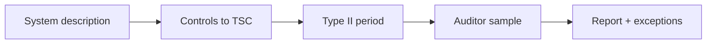

import { ConceptTemplate } from '@/features/kb/components/templates/ConceptTemplate'
import { Callout } from '@/features/kb/components/mdx/Callout'
import { ComparisonTable } from '@/features/kb/components/mdx/ComparisonTable'

export default function Layout({ children }) {
  return (
    <ConceptTemplate title="SOC 2">
      {children}
    </ConceptTemplate>
  )
}

**SOC 2** is an attestation by a CPA firm against the **Trust Services Criteria** (Security always; Availability, Confidentiality, Processing Integrity, Privacy as you add them). A Type I is a point-in-time design review. A Type II tests operating effectiveness over a period (often 3–12 months). Customers ask for the report under NDA. It is not a product certification and not a pentest.

## 1. Deep Dive and Mechanics

**System description.** You write what the system is, the boundaries, and the controls. The auditor tests a sample: access reviews, change tickets, backup restores, vendor reviews, alerts.

**Exceptions.** A failed sample becomes a written exception. Honest exceptions plus a fix beat a fake clean report that a customer later disproves.

**Bridge letters.** After the period, a short letter says "nothing material changed" until the next Type II. Do not treat that as a new audit.

<Callout icon="warning" title="SOC 2 is sampling">
Passing does not mean every laptop was encrypted every day. It means the control operated in the sample.
</Callout>

## 2. Mathematical / Theoretical Foundation

Attestation is statistical sampling over a control population (joiners, changes, incidents). Type II speaks to operating effectiveness across time. Criteria are outcome-oriented; you map your controls to them (CC6 access, CC7 detect, and so on). Residual risk and complementary user-entity controls (CUECs) remind the customer they still have work.

<ComparisonTable
  headers={['Report', 'Says', 'Use']}
  rows={[
    ['SOC 2 Type I', 'Design at a date', 'Early sales'],
    ['SOC 2 Type II', 'Operated over a period', 'Enterprise default'],
    ['SOC 3', 'Public summary', 'Website seal'],
    ['SOC 1', 'Financial reporting controls', 'Payroll / fintech ledgers'],
  ]}
/>

## 3. Real-World Implementation

```text
# Evidence you will be asked for
# - SSO/MFA screenshots + joiner/leaver tickets
# - Change tickets with review for prod deploys
# - Backup restore test notes
# - Risk assessment and vendor list
# - Incident tickets (yes, having some is healthy)
```

Put evidence in the ticket at the time of the work, not in a March panic.

## 4. Visualizations



## 5. Interview Prep

**Q: Type I vs Type II?**
**A:** I is design. II is "did it run for months." Serious buyers want II.

**Q: Security criterion only?**
**A:** Common for a first year. Availability if you sell SLAs. Privacy if you are a processor of personal data at scale.

**Q: Is SOC 2 required by law?**
**A:** No. It is a market and contract expectation.

## 6. Production Use Cases

- **B2B SaaS** security reviews.
- **Data processors** that must show change control.
- **Annual** customer questionnaire replacement (partial).

<Callout icon="tip" title="Write CUECs your customers can actually do">
If you require them to MFA and you never said so, the report will.
</Callout>
