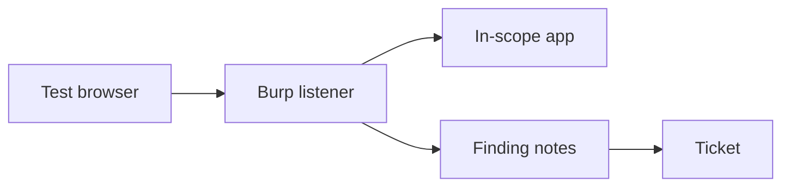

import { ConceptTemplate } from '@/features/kb/components/templates/ConceptTemplate'
import { Callout } from '@/features/kb/components/mdx/Callout'
import { ComparisonTable } from '@/features/kb/components/mdx/ComparisonTable'

export default function Layout({ children }) {
  return (
    <ConceptTemplate title="Burp Suite">
      {children}
    </ConceptTemplate>
  )
}

**Burp Suite** is a desktop proxy that sits between a browser and an app so an authorized tester can see requests the UI hides. PortSwigger ships Community and Professional editions. Defenders and AppSec engineers use it to **verify controls on systems they are allowed to test**. This page does not cover attack recipes or bypass chains.

## 1. Deep Dive and Mechanics

Traffic flows browser to Burp listener to target. The tester maps the app (which routes exist, which cookies are set) and checks whether the server enforces authn/authz that the UI claims. Repeater-style manual review is for understanding a single request you already generated in a normal session — still only in scope.

**In a SOC or platform team.** You care that employees do not point Burp at production without a ticket, that TLS interception uses an org CA you control, and that scan features stay off shared prod data.

**Alternatives.** OWASP ZAP is a common open-source cousin. The discipline is the same: authorized intercept, not "see what happens on a bank you do not own."

<Callout icon="warning" title="A proxy is a privileged seat">
Intercepting TLS requires a trust-on-first-use CA in the browser. Do that only on lab or enrolled test devices.
</Callout>

## 2. Mathematical / Theoretical Foundation

An intercepting proxy is a sanctioned man-in-the-middle for a client you configure. The security properties of the target app should not depend on the client being honest. Burp's value in AppSec is revealing that gap. Scope and legal authorization bound the work; the tool does not.

<ComparisonTable
  headers={['Edition / tool', 'Fits', 'Watch-out']}
  rows={[
    ['Burp Community', 'Manual AppSec learning', 'No licensed scanner'],
    ['Burp Pro', 'Authorized assessments', 'License and data handling'],
    ['ZAP', 'Open-source CI DAST', 'Tune noise'],
    ['Browser devtools', 'Tiny checks', 'Easy to miss cookies'],
  ]}
/>

## 3. Real-World Implementation

```text
# Authorized AppSec session
# - Written scope and staging host only
# - Org test CA on the test browser profile
# - No production customer data in saved project files
# - Findings go to the tracker, not a private stash
```

CI DAST belongs on ephemeral environments with synthetic users.

## 4. Visualizations



## 5. Interview Prep

**Q: Why a proxy instead of only reading code?**
**A:** The running app and the gateway may disagree with the source you were shown.

**Q: Is intercepting HTTPS "breaking encryption"?**
**A:** On a client you control, you installed a test CA. That is a lab technique, not a break of TLS on the internet.

**Q: Burp vs ZAP?**
**A:** Both are intercepting proxies. Pick licensing, CI fit, and team skill.

## 6. Production Use Cases

- **Internal AppSec** reviews of your own APIs.
- **Vendor assessments** with a contract.
- **Developer education** on why HttpOnly and server-side authz matter.

<Callout icon="tip" title="Keep project files out of Slack">
Saved sessions can contain tokens and personal data. Treat them as restricted evidence.
</Callout>
