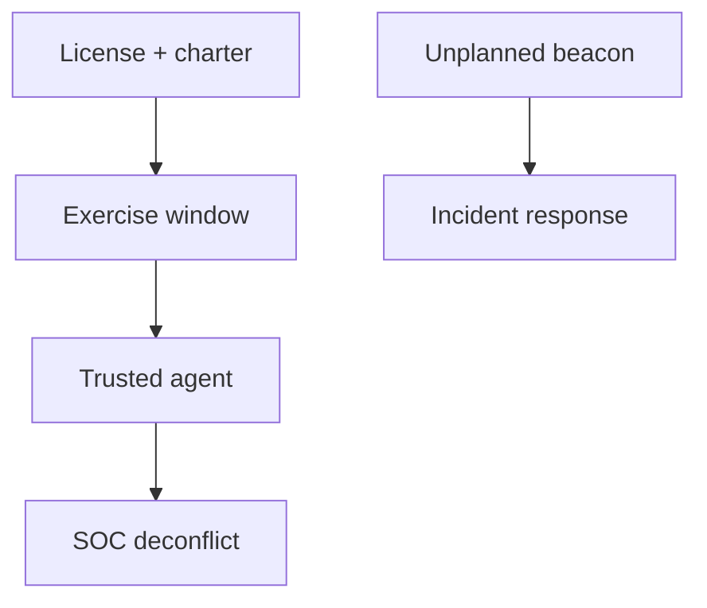

import { ConceptTemplate } from '@/features/kb/components/templates/ConceptTemplate'
import { Callout } from '@/features/kb/components/mdx/Callout'
import { ComparisonTable } from '@/features/kb/components/mdx/ComparisonTable'

export default function Layout({ children }) {
  return (
    <ConceptTemplate title="Cobalt Strike">
      {children}
    </ConceptTemplate>
  )
}

**Cobalt Strike** is a licensed product for **authorized** red-team exercises. Criminals also abuse cracked copies, so SOCs hunt its beacon-like patterns. This page is for **defenders and program owners**: how to govern licensed use and what to detect. It does not describe how to deploy beacons, write payloads, or operate a C2 server.

## 1. Deep Dive and Mechanics

**Legitimate use.** A named red team with a charter, isolated infrastructure, and a halt button. The SOC may be blind during a covert exercise, but a trusted agent knows the infrastructure so a real incident is not confused forever.

**Abuse.** Stolen or cracked kits show up in incidents. EDR and network detections that look for the family's behaviors (odd outbound beacons, unusual process injection themes) are a detection-engineering problem, not a user manual.

**Governance.** Inventory who is allowed to run it, from where, and how long. Cracked copies on a "lab" laptop are a policy failure.

<Callout icon="error" title="Cracked Cobalt Strike is malware">
If it is not licensed and chartered, treat the binary as hostile and the host as infected.
</Callout>

## 2. Mathematical / Theoretical Foundation

C2 detection is a classification problem over periodic outbound connections and host behaviors. Licensed exercises create known-good labels for purple-team tuning. The dual-use nature of the product means your threat model must include both "we hired this" and "someone else did."

<ComparisonTable
  headers={['Context', 'Your job', 'Not your job']}
  rows={[
    ['Licensed exercise', 'Charter, isolate, debrief', 'Unbounded stealth'],
    ['Incident', 'Hunt and contain', 'Replay the kit'],
    ['Vendor intel', 'Ingest IOCs with TTL', 'Hoard samples in Slack'],
    ['HR / legal', 'Who may run it', 'Shadow IT "labs"'],
  ]}
/>

## 3. Real-World Implementation

```text
# Control owners
# - License named to the red-team lead
# - Infra in a dedicated cloud account with egress allow-lists
# - Trusted agent has indicator list for the window
# - After action: detections shipped, copies accounted for
```

SOC runbooks should say how to tell an announced exercise from a real beacon.

## 4. Visualizations



## 5. Interview Prep

**Q: Why do SOCs talk about this product so much?**
**A:** It is common in both paid exercises and crimeware. Detections transfer.

**Q: Should every company buy it?**
**A:** No. Most should buy better logging and a pentest. Simulation platforms are for mature programs.

**Q: What do you do if you find it on a workstation?**
**A:** Isolate, treat as an incident, and check whether a chartered exercise owns that hash and time.

## 6. Production Use Cases

- **Authorized red-team** programs with legal review.
- **Detection engineering** using vendor and community intel.
- **IR** playbooks that deconflict exercises.

<Callout icon="tip" title="Deconflict before you page the CEO">
A five-minute check with the trusted agent prevents two incidents: the real one and the self-inflicted one.
</Callout>
