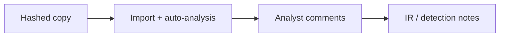

import { ConceptTemplate } from '@/features/kb/components/templates/ConceptTemplate'
import { Callout } from '@/features/kb/components/mdx/Callout'
import { ComparisonTable } from '@/features/kb/components/mdx/ComparisonTable'

export default function Layout({ children }) {
  return (
    <ConceptTemplate title="Ghidra">
      {children}
    </ConceptTemplate>
  )
}

**Ghidra** is a free reverse-engineering framework (disassembler, decompiler, project database). Malware analysts and vulnerability-intake engineers use it on **copies of software they are permitted to study**. This page does not cover cracking, DRM bypass, or turning bugs into exploits.

## 1. Deep Dive and Mechanics

You import a file, let the auto-analysis recover functions and a decompiler view, and write comments that become IR notes. Headless/scripted analysis is for scale (many samples, same questions). Collaboration features exist so two analysts do not fork comments.

**Fit.** Good enough for most defensive RE. Heavy commercial shops may still prefer IDA for some architectures or workflows. The bottleneck is usually analyst time, not the logo.

**Safety.** Open samples only in a lab project directory. Do not auto-analyze mystery files on a domain-joined laptop.

<Callout icon="info" title="Decompiler output is a hypothesis">
It is not the original source. Validate anything you will act on with a second artifact (behavior, log, vendor note).
</Callout>

## 2. Mathematical / Theoretical Foundation

Ghidra recovers a control-flow graph and a lifted intermediate representation, then pretty-prints C-like text. Correctness is heuristic. Packed or obfuscated samples increase the cost. Defenders stop when the decision (family, hunt, patch) is supported.

<ComparisonTable
  headers={['Tool', 'License', 'Defensive fit']}
  rows={[
    ['Ghidra', 'Apache-style free', 'Malware and intake'],
    ['IDA', 'Commercial', 'Shops that already script it'],
    ['Binary Ninja', 'Commercial', 'API-first teams'],
    ['strings + hash', 'OS tools', 'First five minutes'],
  ]}
/>

## 3. Real-World Implementation

```text
# Lab project hygiene
# - Copies only; original hash recorded in the ticket
# - Project on an isolated analyst VM
# - Export: notes and IOCs, not the whole database to Slack
```

Script recurring questions (signer, imports) instead of hand-clicking every sample.

## 4. Visualizations



## 5. Interview Prep

**Q: Why Ghidra over paying for IDA?**
**A:** Cost, scripting, and "good enough" decompiler for many Intel/ARM samples. Use what the team will actually run.

**Q: Can Ghidra run the malware?**
**A:** It is primarily a static RE suite. Dynamic work belongs in a sandbox VM.

**Q: Legal?**
**A:** Analyzing a malware sample you received in IR is normal. Analyzing a competitor's product may not be.

## 6. Production Use Cases

- **SOC malware** queue for unique binaries.
- **Crash intake** on software you ship.
- **Firmware** notes on equipment you operate.

<Callout icon="tip" title="Time-box the decompiler">
If you cannot name a hunt after 90 minutes, escalate or reimage and move on.
</Callout>
