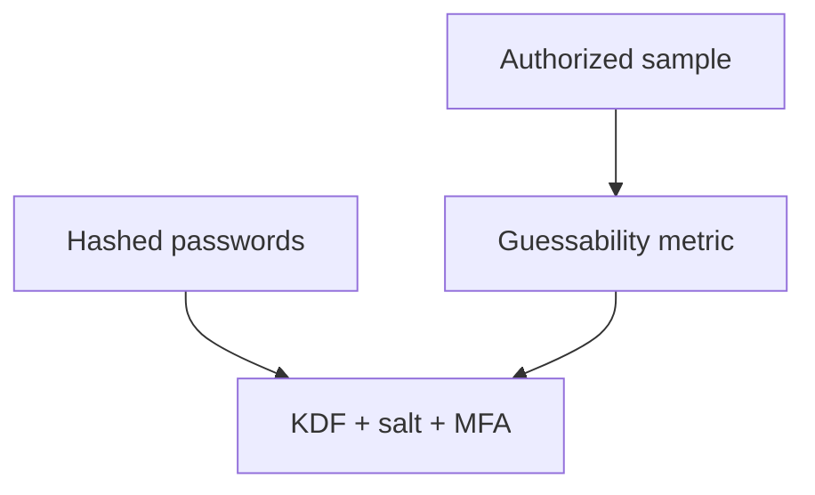

import { ConceptTemplate } from '@/features/kb/components/templates/ConceptTemplate'
import { Callout } from '@/features/kb/components/mdx/Callout'
import { ComparisonTable } from '@/features/kb/components/mdx/ComparisonTable'

export default function Layout({ children }) {
  return (
    <ConceptTemplate title="Hashcat">
      {children}
    </ConceptTemplate>
  )
}

**Hashcat** is a high-performance password-recovery tool. In a defensive program it exists for one reason: **audit hashes you are allowed to have** (your own dump from a test IdP, a lab) so you can show that a policy or a KDF is insufficient. This page does not include recovery recipes, wordlists, or attack modes.

## 1. Deep Dive and Mechanics

Security teams sometimes recover a sample of their own password hashes in a controlled vault to measure guessability. The output is a **policy change** (length, blocklist, MFA, better KDF), not a trophy list of employee passwords in Slack.

**What you should do instead most of the time.** Use a memory-hard KDF (Argon2id), unique salts, breach password blocklists at set time, and phishing-resistant MFA. If you never store recoverable passwords, Hashcat has little to say.

**Legal.** Recovering hashes that are not yours is a crime. "Research" is not a defense if you do not own the data.

<Callout icon="error" title="Do not harvest production hashes for fun">
If you must audit, use an approved extract, a locked lab, and destroy the material after the metric is recorded.
</Callout>

## 2. Mathematical / Theoretical Foundation

Password recovery cost is guesses per second times the size of the guess space. KDFs add CPU/memory per guess. Salts stop precomputation across users. The defender's job is to make expected guesses exceed any reasonable budget and to add a second factor so a guessed password is not enough.

<ComparisonTable
  headers={['Store', 'Recovery cost', 'Do this']}
  rows={[
    ['Plain or reversible', 'Trivial', 'Never'],
    ['Unsalted fast hash', 'Low', 'Migrate now'],
    ['Salted bcrypt/scrypt/Argon2', 'High', 'Good baseline'],
    ['KDF + MFA + blocklist', 'Highest practical', 'Workforce default'],
  ]}
/>

## 3. Real-World Implementation

```yaml
# Password policy (the real control)
min_length: 15
blocklist: breached_passwords
kdf: argon2id
mfa: required_for_all
audit: annual_authorized_sample_only
```

Prefer passkeys or a password manager mandate over teaching people to rotate into seasonal words.

## 4. Visualizations



## 5. Interview Prep

**Q: Why is Hashcat in a security toolkit at all?**
**A:** To measure your own policy on data you own. Not to "see if we can get in."

**Q: Is a long passphrase enough?**
**A:** It helps. MFA and a KDF still matter because people reuse and phishing exists.

**Q: Hashcat vs John?**
**A:** Both are recovery tools. Hashcat is GPU-first. Your policy work is the same.

## 6. Production Use Cases

- **Annual password audit** under legal approval.
- **IdP migration** proving the old KDF was insufficient.
- **Education** for leadership on why MFA is not optional.

<Callout icon="tip" title="Publish the metric, not the passwords">
"12 percent of a sample fell to a modest budget" changes policy. A spreadsheet of names does not.
</Callout>
