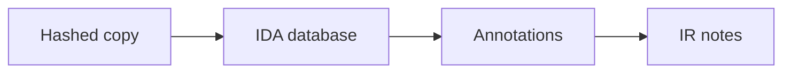

import { ConceptTemplate } from '@/features/kb/components/templates/ConceptTemplate'
import { Callout } from '@/features/kb/components/mdx/Callout'
import { ComparisonTable } from '@/features/kb/components/mdx/ComparisonTable'

export default function Layout({ children }) {
  return (
    <ConceptTemplate title="IDA Pro">
      {children}
    </ConceptTemplate>
  )
}

**IDA Pro** (Hex-Rays) is a long-standing commercial RE workbench: disassembler, optional decompiler, debugger, and a large plugin culture. Defensive teams use it for malware and product crash analysis. This page does not cover exploit development or license circumvention.

## 1. Deep Dive and Mechanics

Workflow matches other RE suites: load a copy, let analysis name functions, add comments, and export notes. The debugger is for **lab VMs**, not production attach. Teams keep IDBs (databases) as work product with the same sensitivity as the sample.

**Why shops pay.** Architecture coverage, FLIRT-style library recognition, and years of internal scripts. Ghidra closed much of the gap for many Intel/ARM tasks.

**License hygiene.** Floating licenses and plugin policy belong to the lab owner. Cracked IDA on an analyst laptop is a compromise, not a shortcut.

<Callout icon="warning" title="A debugger is a live experiment">
Attach only to samples in a disposable VM. Never debug mystery binaries on a corp endpoint.
</Callout>

## 2. Mathematical / Theoretical Foundation

IDA's core is interactive disassembly: the analyst corrects the automatic CFG. The Hex-Rays decompiler is a heuristic translation from a microcode IR. Value is the annotated database, not a perfect C file. Decision-value-per-hour still applies.

<ComparisonTable
  headers={['Need', 'IDA role', 'Cheaper first step']}
  rows={[
    ['Family ID', 'When static is stuck', 'Hash / sandbox'],
    ['Crash root cause', 'Your own binary', 'Symbols + sanitizers'],
    ['Protocol notes', 'Legacy owned gear', 'Vendor docs'],
    ['Training', 'If you already own it', 'Ghidra'],
  ]}
/>

## 3. Real-World Implementation

```text
# Lab standard
# - Licensed IDA on an isolated VM image
# - Samples and IDBs on an encrypted volume
# - Ticket link in the database comment header
```

Back up IDBs like other evidence. They are expensive to recreate.

## 4. Visualizations



## 5. Interview Prep

**Q: IDA vs Ghidra?**
**A:** Both recover CFGs and decompilation. IDA is commercial and script-mature in many shops. Ghidra is free and "good enough" for a lot of defensive work.

**Q: Do you need the decompiler?**
**A:** It speeds reading. You can still work from disassembly if budget is tight.

**Q: Can you share IDBs?**
**A:** Only inside the legal boundary. They may contain customer-derived samples.

## 6. Production Use Cases

- **Malware boutique** analysis.
- **Product security** crash triage on shipped native code.
- **OT firmware** you must support without a vendor.

<Callout icon="tip" title="Scripts beat heroics">
If you open IDA daily, automate the first ten questions.
</Callout>
